# 1강 - MariaDB설치 및 응용

# `학습개요`

### 학습목표

- 데이터베이스의 기본적인 개념을 설명할 수 있다.
- 데이터베이스 시스템의 개념을 설명할 수 있다.
- 관계형 데이터베이스 프로그램에 대한 기본 지식을 설명할 수 있다.
- MySQL 개념을 설명할 수 있다.
- MariaDB개념을 설명할 수 있다.

### 학습내용

- 데이터베이스와 데이터베이스 시스템
- MySQL 설치 및 응용
- MariaDB 설치 및 응용

# `생각해보기`

- 데이터베이스에 대한 개념이 확립되어 있어야 함
- MariaDB를 사용하는 이유와 라이선스에 대한 개념이 확립되어 있어야 함
- RDBMS에 대한 개념이 확립되어 있어야 함

# `일상생활의 데이터베이스`

#### 데이터

- 관찰의 결과로 나타난 정량적 혹은 정성적인 실제 값

#### 정보

- 데이터에 의미를 부여한 것

#### 지식

- 사물이나 현상에 대한 이해

### 데이터베이스

- 조직에 필요한 정보를 얻기 위해 논리적으로 연관된 데이터를 모아 구조적으로 통합해 놓은것

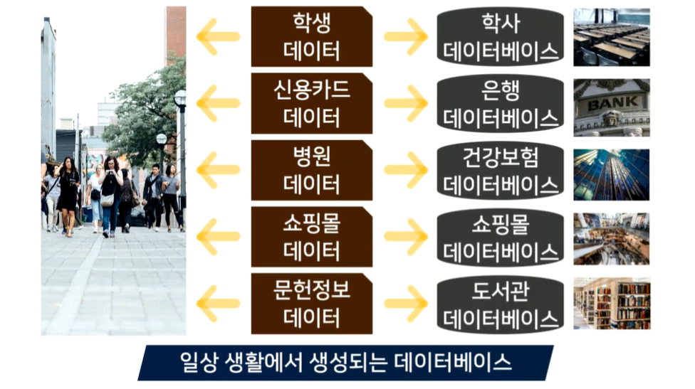

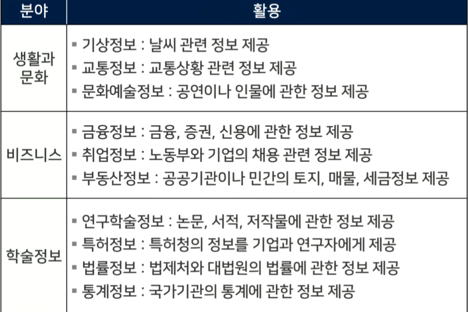

#### 데이터베이스 시스템은 데이터의 검색과 변경 작업을 주로 수행함

- 시간에 따라 변하는 데이터 값을 데이터베이스에 반영하기 위해 수행하는 삽입/삭제/수정(CRUD) 등의 작업

#### 검색과 변경 빈도에 따라 데이터베이스 유형

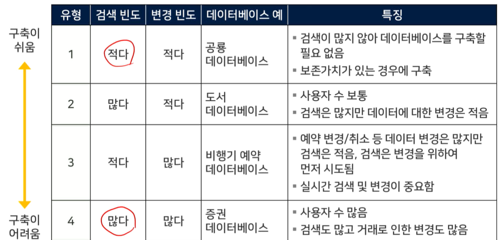

# `데이터베이스의 개념과 특징`

### 개념

#### 통합된 데이터

- 데이터를 통합하는 개념
- 각자 사용하던 데이터의 중복을 최소화하여 중복으로 인한 데이터 불일치 현상을 제거

#### 저장된 데이터

- 문서로 보관된 데이터가 아니라 디스크, 테이프 같은 컴퓨터 저장장치에 저장된 데이터

#### 운영데이터

- 조직의 목적을 위해 사용되는 데이터
- 업무를 위한 검색을 할 목적으로 저장된 데이터

#### 공용 데이터

- 한 사람 또는 한 업무를 위해 사용되는 데이터가 아니라 공동으로 사용되는 데이터

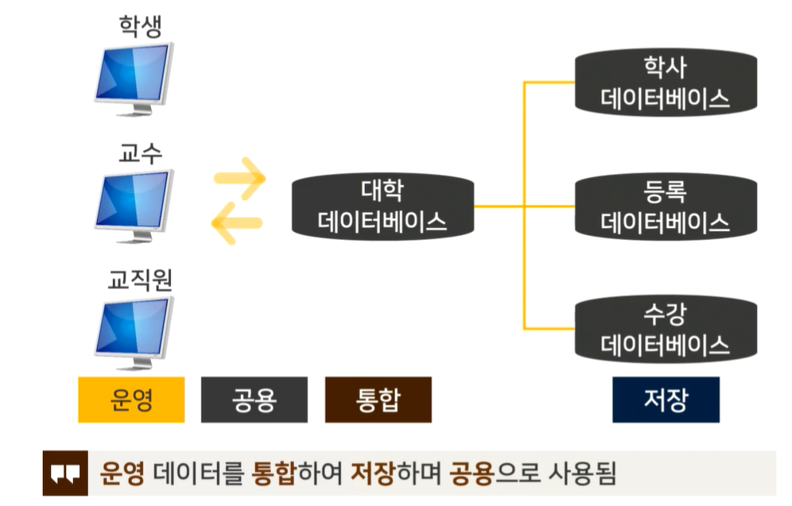

### 특징

- 실시간 접근성
  - 데이터베이스는 실시간으로 서비스됨
  - 사용자가 데이터를 요청하면 몇 시간이나 몇 일 뒤에 결과를 전송한는 것이 아니라 수 초 내에 결과를 서비스함
- 계속적인 변화
  - 데이터베이스에 저장된 내용은 어느 한 순간의 상태를 나타내지만, 데이터 값은 시간에 따라 항상 바뀐
  - 데이터베이스는 삽입, 삭제, 수정 등의 작업을 통하여 바뀐 데이터 값을 저장함
- 동시 공유
  - 데이터베이스는 서로 다른 업무 또는 여러 사용자에게 동시에 공유됨
  - 동시는 '병행'이라고도 하며, 데이터베이스에 접근하는 프로그램이 여러 개 있다는 의미임
- 내용에 따른 참조
  - 데이터베이스에 저장된 데이터는 데이터의 물리적인 위치가 아니라 데이터 값에 따라 참조됨

### 시스템의 구성 요소와 물리적인 위치

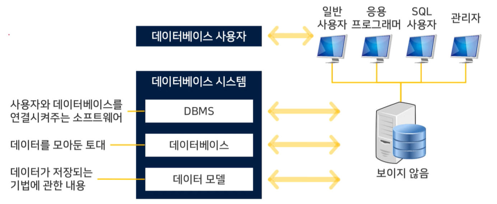

# `데이터베이스 시스템의 예 : 마당서점`

### [1단계] 마당서점의 시작 - 마당서점 초기

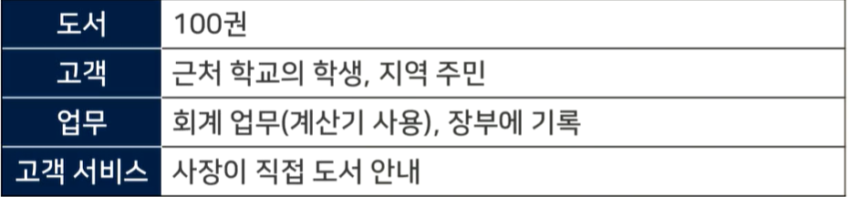

### [2단계] 컴퓨터의 도입 - 마당서점 전산화

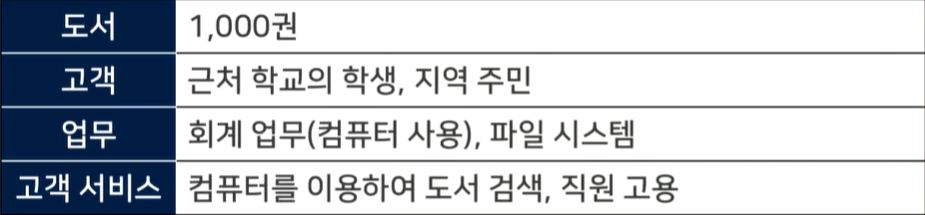

### [3단계] 지점 개설 및 데이터베이스 구축 - 마당서점 DBMS 도입

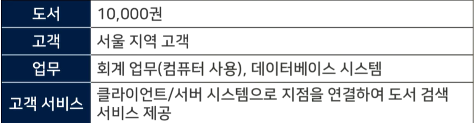

### [4단계] 홈페이지 구축 - 마당서점 인터넷 서비스 실시

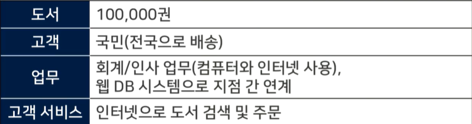

### [5단계] 인터넷 쇼핑몰 운영 - 마당서점 인터넷 쇼핑몰 운영

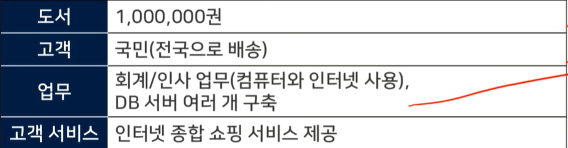

### 정보통신기술의 발전과 마당서점의 성장

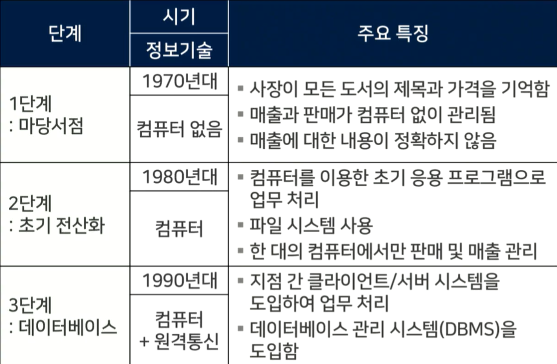

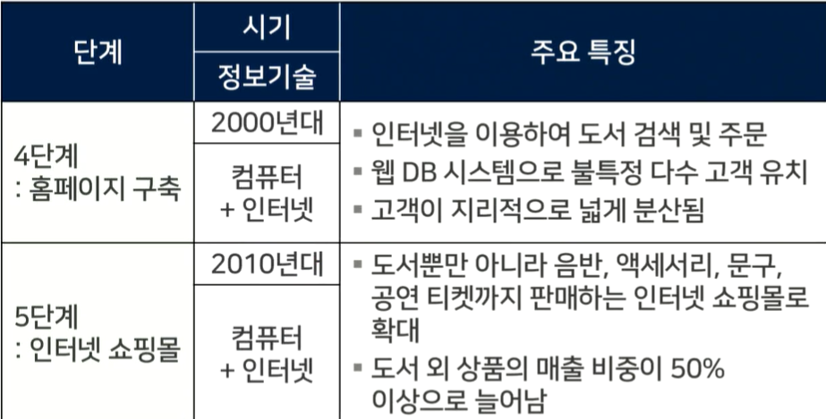

# `정보 시스템의 발전`

### 파일 시스템 : 데이터를 파일 단위로 파일 서버에 저장함

- 각 컴퓨터는 LAN을 통해 파일 서버에 연결, 파일 서버에 저장된 데이터를 사용하기 위해 각 컴퓨터의 응용 프로그램에서 열기/닫기를 요청
- 각 응용 프로그램이 독립적으로 파일을 다루기 때문에 데이터가 중복 저장될 가능성이 있음
- 동시에 파일을 다루기 대문에 데이터의 일관성이 훼손될 수 있음

### 데이터베이스 시스템 : DBMS를 도입하여 데이터를 통합 관리하는 시스템

- DBMS가 설치되어 데이터를 가진 쪽을 서버, 외부에서 데이터 요청하는 쪽을 클라이언트라고 함
- DBMS 서버가 파일을 다루며 데이터의 일관성 유지/복구/동시접근제어 등의 기능을 수행
- 데이터의 중복을 줄이고 데이터를 표준화 하며 무결성을 유지

### 웹 데이터베이스 시스템 : 데이터베이스를 웹 브라우저에서 사용할 수 있도록 서비스하는 시스템

- 불특정 다수 고객을 상대로 하는 온라인 상거래나 공공 민원 서비스 등에 사용됨

### 분산 데이터베이스 시스템 : 여러 곳에 분산된 DBMS 서버를 연결하여 운영하는 시스템

- 대규모의 응용 시스템에 사용됨

# `데이터베이스의 이해`

### 용어 정리

- DBMS : 정보를 DB에 저장하고 사용자에게 요구된 형태의 정보로 제공하는 컴퓨터 기반 시스템
- 스키마 : 데이터가 저장되는 형식을 결정하는 전반적인 구조
- 인스턴스 : 특정 시점에서의 DB에 저장된 정보의 집합
- 데이터 모델 : 데이터 타입, 데이터의 연산 및 데이터의 의미 및 일관성 제약조건을 명시하기 위해 사용하는 개념의 집합
- DBMS 3단계 구조 : 데이터 추상화와 데이터 독립성을 확보하기 위한 개념정/논리점/물리적 3단계 구조

### 시스템의 개요

- 실제적으로 방대한 데이터를 효과적으로 처리하기 위해 DB응용이 필수적
- DB를 정확하게 사용하기 위해서는 DB응용이 필수적

### DBMS의 특징

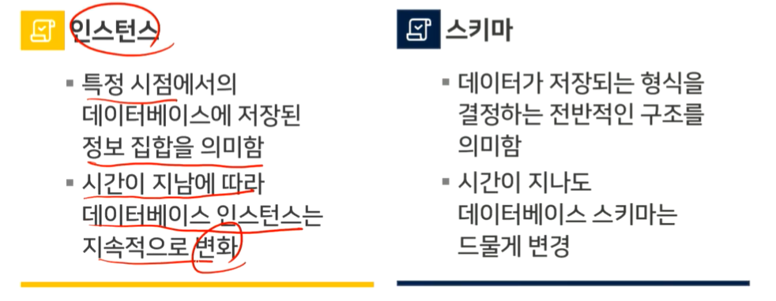

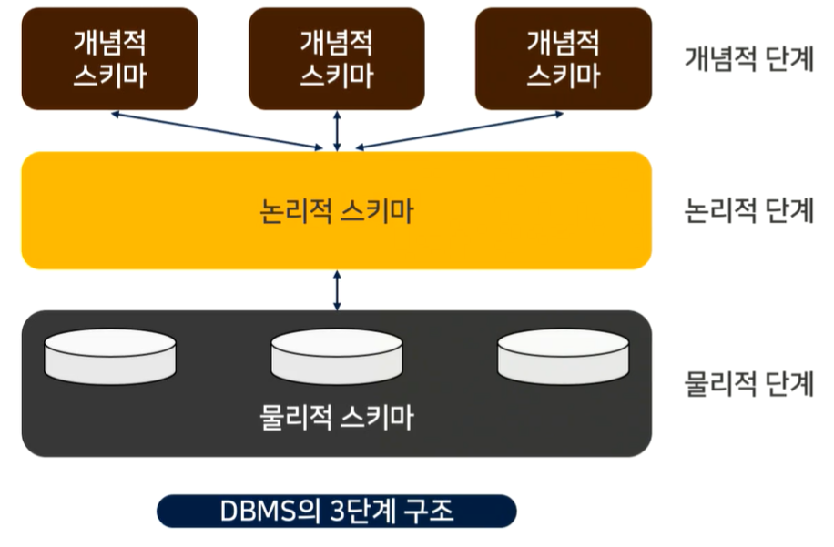

### 데이터베이스 모델

- 사용 가능한 데이터만을 선별하여 구조화 된 데이터베이스에 저장, 사용할 방법이 필요
  - 데이터 모델 : 의미, 데이터 타입, 연산 및 제약 조건을 명시하기 위해 사용할 수 있는 개념들의 집합
  - 데이터 모델링 : 실제적인 비즈니스 모델을 DBMS가 지원하는 데이터 모델의 형태로 나타내는 과정
- ER 모델
  - 실제 모델에 기초하여 실제 모델의 객체를 나타내는 개체들과 개념들 간의 관계로 구성
- 관계형 모델
  - 릴레이션이라고 하는 표 형태의 데이터 구조를 사용하여 데이터를 저장함
- 객체지향적 모델
  - 객체들을 기반으로 데이터베이스를 구성
    - 캡슐화를 유지, 프로그램과 데이터 간의 불일치 감소
  - 다중 상속을 통해 정보 최적화
    - 다른클래스들로부터 필요한 특징을 다중 상속

### ER 모델의 예

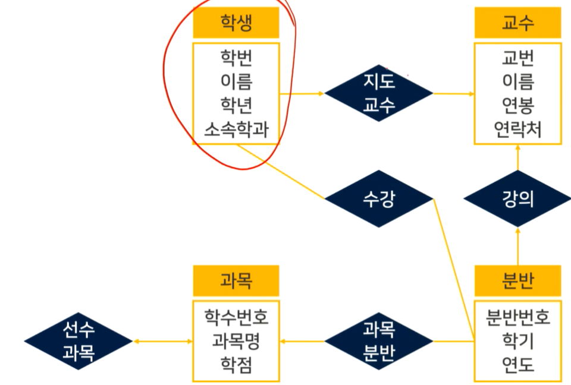

# `MySQL 설치 방법`

# `MySQL 설치 실습`

# `MySQL 사용 -> 기본 SQL문 설명`

# `MySQL 간단한 응용 실습`

# `MariaDB 설치 방법`

# `MariaDB 설치 및 사용 실습`

# `MariaDB 응용`

# `응용 소프트웨어 실습`

