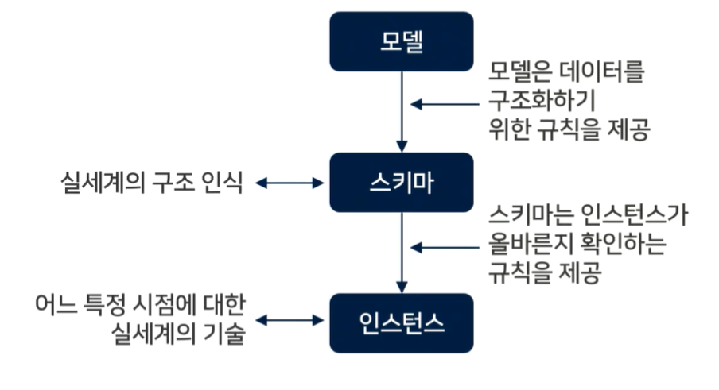

# 2강 - 기본 SQL 작성1

# `학습개요`

### 학습목표

- 기본적인 데이터베이스의 개념을 설명할 수 있다.
- 관게형 데이터베이스에 대한 개념을 설명할 수 있다.
- 기초적인 기본 SQL에 대해 설명할 수 있다.

### 학습내용

- SQL 활용 능력 단위
- 기본 SQL

# `생각해보기`

- 보통 데이터베이스라고 하면 관계형 데이터베이스를 의미
- 관계형 데이터베이스를 사용할 수 있게 해주는 것
  - 오라클 MySQL, MariaDB와 같은 RDBMS

# `정보시스템과 데이터베이스`

### 정보시스템

- 조직에서 필요한 데이터를 수집 및 가공, 저장하여 업무 운영 및 의사결정에 필요한 정보를 

  제공하는 시설,장비(컴퓨터 하드웨어와 소프트웨어, 통신 수단 등 포함)

- 데이터

  - 현실 세계에서 관찰과 측정을 통해 수집한 가공되지 않은 단순한 사실이나 결괏값

- 정보 

  - 의사 결정에 활용하기 위해 데이터를 유용한 형태로 가공/처리해서 얻은 결과

- 데이터 처리 형태

  - 

### 데이터베이스

- 조직에서 운영과 의사 결정에 필요한 데이터들으 여러 사용자(또는 응용시스템)들이 공동으로 사용할 수 있도록 구조적으로 통합하여 컴퓨터로 저장한 데이터들의 모음
- 엄무 처리에 필요한 데이터를 활용하기 유용한 구조로 저장한 데이터의 집합
- 학사관리, 도서관리 등 관련 데이터를 검색/수정/삭제가 쉽도록 구조화 하여 저장한 데이터의 모음
- 저장된 데이터와 저장된 데이터의 구조와 제약사항 등에 대한 메타데이터(데이터 사전 / 시스템 카탈로그)를 포함함

####  - 정의

- 통합된 데이터 : 동일 데이터에 대한 중복 최소화
- 저장된 데이터 : 컴퓨터가 접근할 수 있는 기억장치에 저장된 데이터
- 운영 데이터 : 존재 목적이 명확하여 유용성을 지닌 데이터
- 공용 데이터 : 여러 사용자가 서로 다른 목적으로 사용하는 공유 가능한 데이터

#### - 특징

- 실시간 접근성 : 사용자 또는 시스템이 질의에 대하여 실시간처리 및 응답을 할 수 있어야 함
- 계속적인 변화 : 데이터베이스는 데이터의 삽입/ 삭제/갱신 작업으로 인해 동적으로 계속 변화하며, 항상 최신의 데이터를 유지해야 함
- 동시 공용 : 데이터베이스는 다수의 사용자 또는 시스템이 동시에 같은 내용의 데이터를 이용할 수 있어야 함
- 내용에 의한 참조 : 데이터베이스에 저장된 데이터를 참조할 때 저장된 레코드의 주소나 위치가 아니라 사용자가 요구하는 데이터의 내용을 기반으로 참조함

# `데이터베이스 시스템`

### 정의

- 데이터베이스 시스템 : 데이터베이스를 이용하여 데이터를 저장하고 관리해서 필요한 정보를 생성하는 컴퓨터 시스템
- 기존 파일 시스템의 문제점인 데이터의 종속성과 중복성을 개선하기 위해 개발됨
  - 파일 시스템은 응용 프로그램과 데이터 간의 상호의존 관계가 긴밀하여 파일에 저장된 데이터의 구조가 변경되면 응용 프로그램을 수정해야 하는 데이터 종속성이 존재함
  - 파일 시스템에서는 같은 내용의 데이터가 여러 파일에 중복되어 저장되므로 데이터의 일관성이나 무결성 유지와 데이터 보안이 어려움

### 파일 시스템과 데이터베이스 시스템 활용 사례

#### 파일 시스템 시스템 활용 사례

#### 데이터베이스 시스템 활용 사례

### 데이터베이스 시스템의 구성요소

- 시스템 카탈로그(데이터 사전)
  - 데이터베이스 스키마와 메타 데이터
- 데이터베이스 관리 시스템(DBMS, Database Management System)
- 데이터베이스 사용자
- 데이터베이스 언어(SQL)
- 데이터베이스 컴퓨터(서버)

### 시스템 카탈로그(데이터 사전)

- 데이터사전(Data Dictionary) 또는 시스템 테이블이라고도 함
- 데이터베이스의 객체(사용자, 릴레이션, 뷰, 인덱스, 권한 등)와 구조들에 관한 모든 데이터(메타데이터)를 포함하는 시스템 테이블을 의미
- 사용자 릴레이션처럼 SELECT문을 사용하여 내용을 검색할 수 있지만 어떤 사용자도 직접 갱신할 수 없음
  - DELETE, UPDATE 또는 INSERT문을 사용하여 시스템 카탈로그를 변경할 수 없음
- DBMS는 시스템 카탈로그에 릴레이션, 애트리뷰트, 인덱스, 사용자, 권한 등 각 스키마 객체 유형별로 별도의 정보 테이블을 유지함

# `데이터베이스 사용자`

### 데이터베이스 관리자(DBA, Database Administrator)

- 데이터베이스를 정의하고 제어하는 사람 또는 그룹
- 데이터베이스 관리시스템과 컴퓨터 시스템에 대한 지식을 보유해야함
- 데이터베이스를 설계,관리, 운용 및 통제하는 역할 담당, 데이터베이스 시스템을 감시하고 성능을 분석

### 데이터 설계자 (DA, Data ARchitect)

- 조직 또는 기업의 전사 데이터 구조를 체계적으로 정의하는 사람 또는 그룹
- 데이터 설계원칙과 데이터 표준 정의, 데이터 관리체계수립 등 데이터 모델링과 데이터 구조 관리를 수행

### 응용 프로그래머(Application Programmer)

- 프로그래밍 언어를 이용하여 데이터베이스에 접근하여 데이터를 검색하거나 조작하는 사람을 의미
- 프로그래밍 언어와 데이터베이스 언어, 데이터베이스 관리시스템에 대한 지식이 있어야 함

### 일반 사용자(End User)

- 데이터를 검색하거나 조작하기 위해 데이터베이스 질의어를 이용하여 데이터베이스 관리시스템에 접근하는 사람을 의미

# `데이터베이스 관리시스템(DBMS)의 개념과 기능`

### 개념

- DBMS 
  -  데이터베이스를 통합 관리하는 소프트웨어 패키지
- 사용자가 새로운 데이터베이스를 생성하고, 데이터베이스의 구조를 명시할 수 있게 하고, 데이터를 효율적으로 질의하고 수정할 수 있도록 함
- 시스템의 고장이나 권한이 없는 사용자로부터 데이터를 안전하게 보호
- 동시에 여러 사용자가 데이터베이스에 접근하는것을 제어

- 데이터베이스를 정의하고 질의어를 지운, 리포트를 생성하는 등의 작업을 수행하는 소프트웨어
- 데이터베이스에 대한 효율적 접근과 질의 긴으 제공, 프로그램과 데이터 간의 독립성 보장

### 필수 기능

- 정의 기능 : 데이터베이스에 저장된 데이터의 타입과 주고, 제약조건 등을 명시하는 기능 제공
- 조작 기능: 데이터를 검색하고 삽입/삭제/갱신 등 데이터 처리 기능 제공
- 제어 기능 : 데이터의 정확성과 안전성을 유지하기 위한 무결성 관리/병핸제어/접근제어 등의 기능 제공

### 도입시 장/단점

- 장점
  - 데이터 중복 최소화 : 데이터 통합 구성, 제어된 중복
  - 데이터 공용 : 데이터 공유로 데이터 유지 부담 면제
  - 무결성 : 데이터베이스에 저장된 값과 현실 세계 실제 값의 정확성
  - 일관성 : 중복 데이터간 불일치성 제어
  - 표준화 : 데이터 처리/제어 기능 표준화
  - 보안 : 데이터베이스 관리/접근제어, 의도적, 불법정, 우연한 데이터의 손상 보호
- 단점
  - 운영비 증대 : DBMS 도입 비용, 시스템 운영비, 특정 운영 프로그램
  - 복잡화 : 특수 목적 Application 구조 복잡, 성능 저하
  - 복잡한 백업과 회복  :장애를 대비한 백업/회복 수립 필요
  - 시스템 취약성 : DB장애가 전체 시스템 정지 초래

### DBMS 구성 요소

# `ANSI/SPARC 3단계 스키마 구조와 데이터 독립성` 

- ANSI/SPARC 3단계 스키마 구조와 데이터 독립성

  - 미국 국립 표준화 기관 ANSI/SPARC(American National Standards Institute/System Planning And Requirements Comittee)에서 1978년에 제정함
  - 대부분의 사용 DBMS에서 활용하는 아키텍처로써 외부 단계/개념적 단계/물리적 단계로 구성
  - 데이터베이스를 사용자 관점(외부 단계), 통합 모델 관점(개념적 단계, 저장 장치(물리적 단계))의 세 가지 관점
    - 아키텍처와 상호 연관 관계를 정의한 3단계 스키마 구조로 데이터의 독립성을 조장

  ### 3단계 스키마

  

  ### 데이터 독립성

  - 데이터베이스의 논리적/물리적 구조를 변경하더라도 응용프로그램이 영향을 받지 않는 특성
  - 
  - 데이터독립성을 보장하기 위해서는 데이터베이스 스키마 간의 사상이 필요함
  - 스키마 간 사상 정보는 시스템 카탈로그에 저장됨
  - 

# `스키마와 인스턴스`

### 스키마

- 데이터베이스의 구조와 제약조건에 관한 전반적인 명세를 의미함
- 메타데이터 또는 내포라고도 함

- 실세계의 특정 부분을 표현하며 특정 데이터 모델을 사용하여 만들어짐
  - 하나의 조직에서 관심이 있는 데이터의 구조를 기술한 언어적이고 그래픽적인 표현으로 시간 독립적인 고정된 집합체
- 데이터 모델은 데이터베이스의 구조를 기술하는데 사용되는 개념들의 집합과 연산자, 제약조건들을 포함한 것으로 다양한 데이터 모델이 존재
- 데이터의 구조를 나타내는 데이터 사전인 DBMS의 시스템 카탈로그에 저장됨

### 인스턴스

- 스키마에 의해 정의된 특정 시점의 데이터들의 모임을 말하며 시간에 따라 동적으로 변화
- 특정 시점의 데이터베이스 상태를 나타내 외연(Extension)이라고도 함

- 데이터 모델과 스키마, 인스턴스의 관계
  - 

# `관계형 데이터베이스 기초`

### 관계형 데이터베이스 설명

- 현재 가장 많이 사용되는 데이터베이스 모델

  - 데이터가 테이블 형태로 표현되며, 사용자가 데이터를 쉽게 다룰 수 있도록 해주는 질의어(SQL)을 제공함
  - 테이블 형태로 표현된 데이터는 단순해서 누구나 쉽게 이해할 수 있으며 SQL은 자연어에 가까운 문법을 가지고 있어 배우기 쉬움
    - 데이터를 어떻게 가져올 것인가 대신에 어떤 데이터를 원하는지만 기술해주면 되기 때문에 사용자나 개발자의 입장에서는 데이터를 다루는 작업이 매우 단순해짐
  - SQL 명령어나 문법은 표준화되어 있으므로 대부분의 명령어는 모든 관계형 데이터베이스 제품에서 공통으로 사용할 수 있음
    - Oracle,  MsSql, MySQL ,MariaDB, PostgreSQL, SQLLite, DB2

  ### 관계형 데이터베이스의 주요 용어

  - 릴레이션 : 2차원의 테이블
  - 레코드 : 릴레이션의 각 행
  - 튜플 : 레코드를 좀 더 공식적으로 부르는 용어
  - 애트리뷰트 : 릴레이션에서 이름을 가진 하나의 열
  - 도메인
    - 한 애트리뷰트에서 나타날 수 있는 값들의 집합
    - 프로그래밍 언어의 데이터 타입과 유사하며, 같은 도메인이 여러 애트리뷰트에서 사용될 수 있음
  - 차수 : 
    - 한 릴레이션에 들어 있는 애트리뷰트들의 수
    - 유효한 릴레이션의 최소 차수는 1이며 릴레이션의 차수는 자주 바뀌지 않음
  - 카디날리티 
    -  릴레이션의 튜플 수, 유효한 릴레이션은 카디날리티 0을 가질 수 있으며 릴레이션의 카디날리티는 시간이 지남에 따라 계속해서 변함
  - 널 값 : 
    - '알려지지 않음' 또는 '적용할 수 없음' 을 나타내기 위해 사용하는 개념
    - 숫자 '0'도 아니고 공백 문자 ", 공백문자열 ""도 아닌 정해지지 않은 값을 의미함
  - 릴레이션 스키마
    - 릴레이션의 이름과 릴레이션의 애트리뷰트들의 집합을 말함
    - 릴레이션을 위한 틀
  - 릴레이션 인스턴스
    - 특정 시점에 릴레이션에 들어있는 튜플들의 집합, 시간의 흐름에 따라 계속 변함

  ### 관계형 데이터 모델 개념

  

  ### 관계형 데이터 모델의 표현

  

  

# `SQL 개요`

### SQL 개념

### 활용

### 데이터베이스, 기본 SQL 작성하기

### 처리 유형

### 특징

### 종류

### 문법

# `데이터 검색`

### SELECT문 형식

- 관계대수의 셀렉션, 프로젝션, 조인, 카티션 곱 등을 결합한 데이터 조회 명령

# `데이터 조작`

### INSERT문 형식

### DELETE문 형식

### UPDATE문 형식

# `데이터 권한 제어`

### DCL(Data Control Langyuage)기본 개념

- 데이터베이스 규정이나 기법을 정의하고 제어하는 언어
- 사용자 권한을 부여하거나 취소하는 명령어와 트랜잭션을 제어하는 명령어를 포함함
  - 트랜잭션 제어 명령을 이용해 데이터베이스의 무결성/보안/회복/동시성제어를 수행할 수 있음

### DCL종류

- 

### 권한 허가(GRANT)

### 권한 취소(REVOKE)

### 역할(Role)

### 객체 권한과 시스템 권한

# `기본적인 SQL 사용법 실습`

