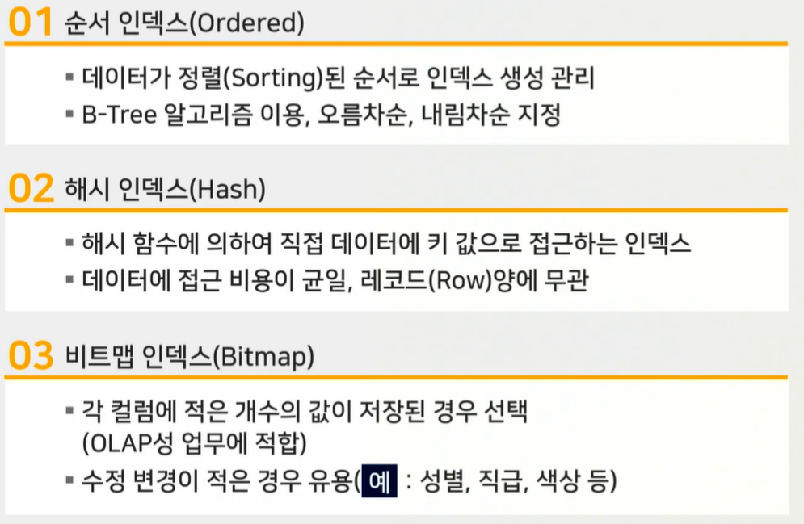
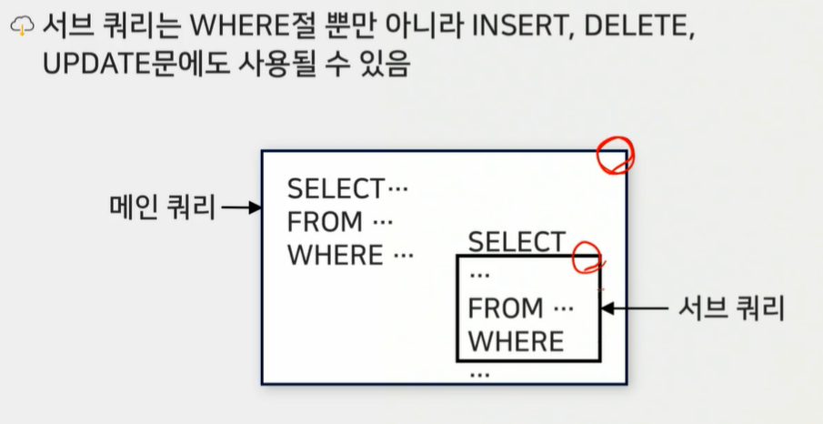
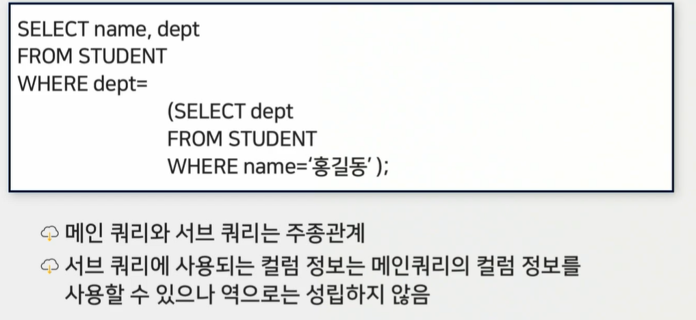

# 4강 - 고급 SQL 작성

# `학습개요`

학습목표

- 뷰의 대한 개념을 설명할 수 있다.
- 인덱스에 대한 개념 및 사용법을 설명할 수 있다.
- 집합연산에 대한 사용법을 설명할 수 있다.
- 조인에 대한 개념과 사용법을 설명할 수 있다.
- 서브 쿼리에 대한 개념을 설명할 수 있다.

학습내용

- 고급 SQL 작성
- 뷰(VIEW)
- 인덱스(INDEX)집합연산
- 조인 
- 서브 쿼리
- 기본 SQL

# `생각해보기`

2개 이상의 테이블에서 데이터를 가져올 때는 조인을 통해 관계성이 있는 데이터를 가져올 수 있음

- 은행에서 고객에 대한 계좌 리스트와 리스트에 포함된 거래 내역을 가져오는 것과 같음

# `고급 SQL 작성`

#### DB엔지니어링, SQL 활용, 고급 SQL 작성하기

 

# `뷰의 개념`

#### 뷰 : 허용된 자료만을 제한적으로 보여주기 위해 하나 이상의 테이블로부터 유도딘, 이름을 가지는 가상 테이블

기본 테이블처럼 행(Row)과 컬럼(Column)으로 구성됨

- 다른 테이블에 있는 데이터를 보여줄 뿐이지 데이터를 직접 담고 있지는 않음

 

# `뷰의 특징`

- 저장 장치 내에 물맂거으로 존재하지 않음(가상 테이블)
- 데이터 보정 등 임시적인 작업을 위한 용도로 사용함
- 기본 테이블과 같은 형태의 구조로 조작이 거의 비슷함
- 삽입, 내용 갱신에 제약이 따름

- 논리적 독립성을 제공
- 독자적인 인덱스를 가질 수 없음
- Create를 이용하여 뷰를 생성
- 필요한 데이터만 골라 뷰를 이용하여 처리

# `뷰의 사용`

#### 뷰를 사용하는 주된 이유

- 다음과 같은 단순한 질의어를 사용할 수 있기 때문
- SELECT * FROM <VIEW NAME>;
- FROM절에 있는 하나의 <뷰>를 통해 뷰를 구성하는 복수의 <테이블>을 대체하는 단순성에 그 의의가 있음

#### 뷰의 장점

 

 

#### 뷰의 단점

 

# `뷰의 생성`

#### 명령의 일반적인 형태

CREATE VIEW <뷰 이름> (컬럼목록) AS <뷰를 통해 보여줄 데이터 조회용 쿼리문>

#### 상황별 뷰 생성하는 방법

 

# `뷰의 삭제 및 변경`

##### 뷰 정의 자체를 변경하는 것은 불가능

- 일단 뷰를 정의하면, 뷰의 물리적 내용은 뷰의 이름과 데이터를 조회하기 위한 쿼리문 뿐임
- 뷰의 이름이나 쿼리문을 변경하는 순단은 제공되지 않음

##### 뷰의 삭제와 재생성을 통해 뷰에 대한 정의 변경이 가능

 

# `뷰의 내용 변경`

 

# `인덱스의 개념`

#### 인덱스

- 데이터를 빠르게 찾을 수 있는 수단으로서, 테이블에 대한 조회 속도를 높여 주는 자료구조
- 테이블에서 자주 사용되는 컬럼 값을 빠르게 검색할 수 있도록 색인을 만들어 놓은 것

##### 과다한 사용은 성능을 떨어뜨림 

##### 필요 없는 인덱스가 많아지면 DB에 차지되는 공간이 많아서 Table scan보다 속도가 느려질 수 있음

# `인덱스의 구조와 장점`

 

# `인덱스의 사용`

##### 테이블의 특정 레코드 위치를 알려주는 용도로 사용함

- 인덱스는 자동으로 생성되지 않음
- PK컬럼은 PK를 생성할 때 자동으로 인덱스가 생성됨

##### 일련번호를 기본키(Primary Key)로 하는 경우

 

 

# `인덱스 종류`

 

 

 

#### 해시 인덱스

##### 데이터의 신속한 검색을 위해 키 값에 해시 함수를 적용하여 주소 값을 빠르게 계산하고 레코드가 저장된 위치를 직접 접근하는 방법

- (키 값, 주소)의 쌍으로 저장하므로 특정 키 값에 대한 검색 방법 중에서 가장 빠름

 

#### 해시 함수

 

 

#### 해시 인덱스

 

 

 

#### 인덱스 조작

 

 

#### 인덱스 명령문 요소

 

#### 인덱스 삭제

####  

#### 

#### 인덱스 변경

 

#### 인덱스 스캔 방법

 

 

 

# `집합연산의 개념 및 유형`

#### 개념

- 테이블을집합 개념으로 보고, 두 테이블 연산에 집합연산자를 사용하는 방식
  - 집합연산자는 여러 질의 결과를 하나의 결합하는 방식을 사용함
  - 집합연산자는 2개 이상의 질의 결과를 하나의 결과로 만들어 줌

#### 유형

 

# `UNION`

##### 합집합을 의미

- 두 개의 데이터 집합이 있으면 각 집합 원소를 모두 포함한 결과가 반환

 

# `UNION ALL`

#### UNION과 비슷하나, 중복된 항목도 모두 조회됨

 

# `INTERSECT와 MINUS`

#### INTERSECT

##### 합집합이 아닌 교집합을 의미

 

#### MINUS

##### 차집합을 의미

한 데이터 집합을 기준으로 다른 데이터 집합과 공통된 항목을 제외한 결과만 추출해 냄

 

# `조인 개요`

##### 두 개 이상의 테이블로부터 연관된 데이터를 결합해서 검색하는 방법

 

#### 유형

 

# `논리적 조인`

#### 내부 조인과 외부 조인, 셀프 조인으로 구분

 

 

# `서브 쿼리의 개념`

#### 다른 SQL문 안에 포함되어 사용된 또 다른 SQL문을 의미

 

 

# `서브 쿼리 유형`

##### 서브 쿼리는 동작하는 방식이나 반환되는 데이터의 형태에 따라 분류

#### 동작하는 방식에 따른 서브 쿼리의 종류

 

#### 반환되는 데이터 형태에 따른 서브 쿼리의 종류

 

 

#### IN/NOT IN 연산자가 사용된 서브 쿼리 예

 

#### ALL 연산자가 사용된 서브 쿼리 예

 

#### EXISTS연산자가 사용된 서브 쿼리 예

 

#### 상관 서브 쿼리 예

 

# `테이블, 트랜잭션 실습`

