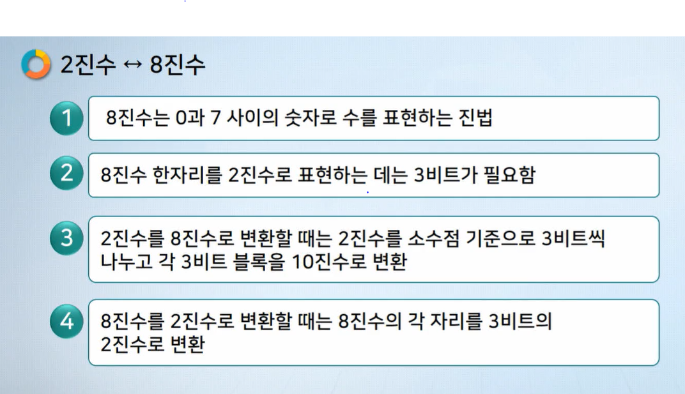
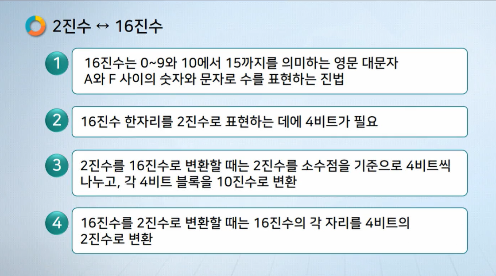
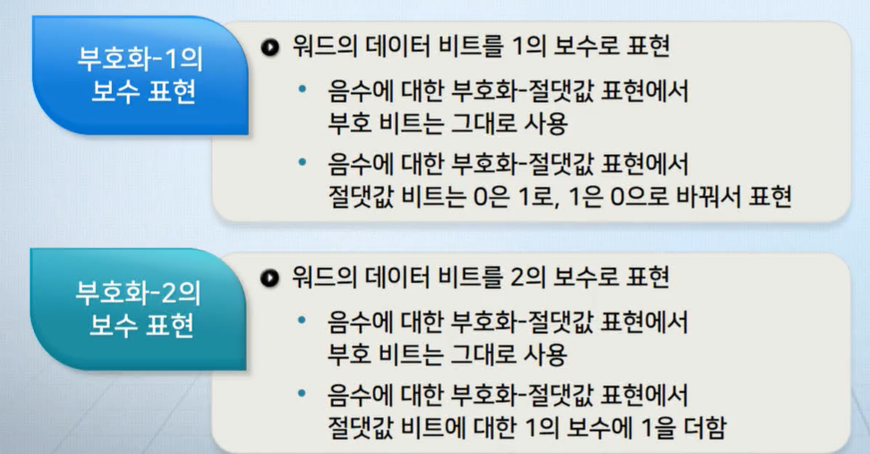
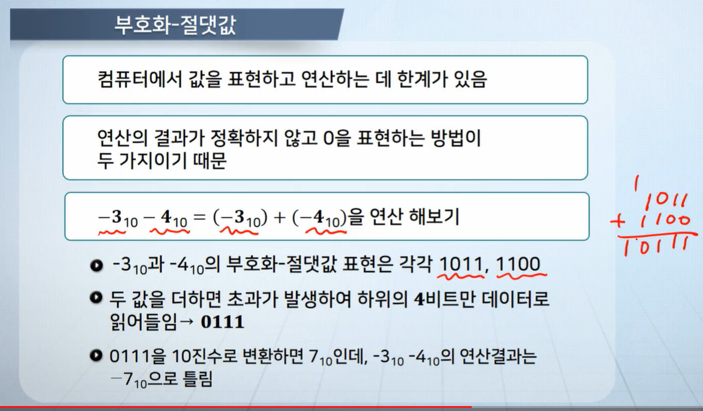
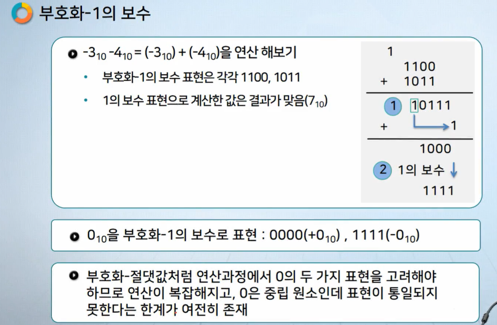
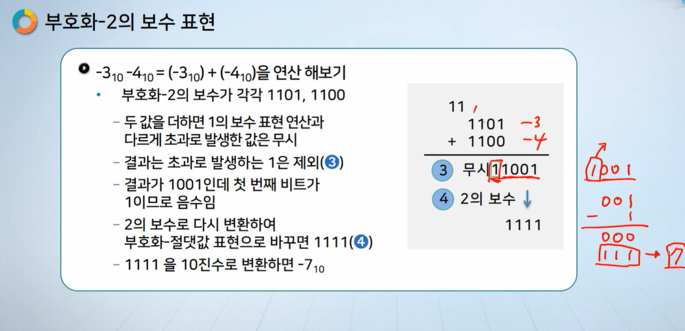
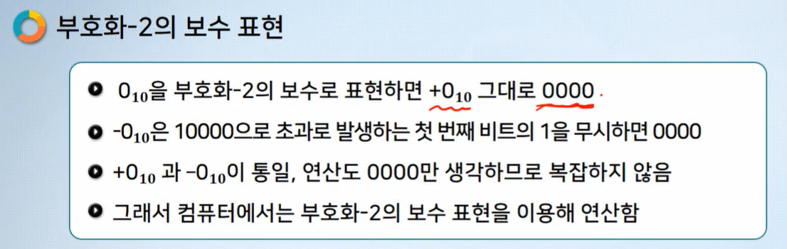

# 1강 - 수의 표현

## `이산수학이란?`

### 이산 수학 정의

- 실수와 같이 연속적인 성질을 가진 값에 대해 공부하는 학문이 아닌, 정수와 같이 분리된 값에 대해 공부하는 학문
- 컴퓨터에 적용되는 많은 개념들이 이산적인 개념에 포함
- 이산수학은 명제나 논리의 참과 거짓, 집합의 포함, 관계의 유무, 함수의 입출력 등과 같이 확실하게 분리되는 개념을 다룸

### 이산수학 학습의 필요성

- 이산수학에서 다루는 개념들은 명령 설계에서 입력 처리, 결과 출력까지 컴푸터의 모든 과정을 이해하는 데 기본이 됨

## `수업계획`

### 수업 목표

- 이산수학은 사람이 컴퓨터에 관련된 전반적인 분야를 이해할 수 있도록 도와주는 가장 기본적인 학문으로 수업을 수강하시는

​      분들이 이러한 능력을 갖추는 것을 목표로 함

### 수업 내용 개요

- 컴퓨터의 기초가 되는 수학적 논리를 기본으로 하여 집합과 함수, 관계, 트리, 그래프, 부울대수 등을 학습함으로써 알고리즘 

  작성에 필요한 논리적인 사고를 키우고자 함

### 교과목 수준

- 기초부터 천천히 수업을 진행함

### 수업 운영 전략

- 차질 없이 원활한 수업 진행을 위해 공지 내용을 반드시 확인

- 과제 수행하기 위해 수업 강의 및 인터넷 검색을 활용할 수 있음

### n진법 / n진수

- 0과 n-1사이의 숫자들을 이용해 수를 표현하는 방식 또는 그렇게 표현된 수

- 현재 n진법을 사용하고 있다면 n을 기수(Base Number)라고 함
- 기수 표기 및 읽는 방법
  - 8진수 : '8진수 일삼육오'라고 읽음
- 기수 n은 어떤 값이든 제한 없음

### 10진수 

- 기수를 10으로 한느 수 체계, 0과 9사이의 숫자를 이용해 수를 표현

- 정수 n에 대해( k > 0, 0 <= 0 <= 9)
- 실수 n에 대해(k, l >0, 0<= a <= 9)

### 2진수 (Binary Number)

- 기수를 2로 하는 수 체계, 0과 1을 이용해 수를 표현
- 정수 n에 대해(k > 0, a = 0 or 1)
- 실수 n에 대해(k, l > 0, a = 0 or 1)

### 8진수 (Octal Number)

- 기수를 8로 하는 수 체계, 0과 7사이의 숫자를 이용해 수를 표현
- 정수 n에 대해(k > 0, 0<= a <= 7)
- 실수 n에 대해(k, l > 0, 0<= a <= 7)

### 16진수 (Hexadecimal Number)

- 기수를 16로 하는 수 체계, 0과 7사이의 숫자를 이용해 수를 표현
- 정수 n에 대해(k > 0, 0<= a <= 9 또는 A <= a <= F)
- 실수 n에 대해(k, l > 0, 0<= a <= 9  또는 A <= a <= F)

## `진법 간 변환`

### 진법 간 변환 : 흐름

- 10진수 -> 2진수/8진수/16진수
  - 정수부 : 변환하려는 기수로 몫이 0이 될 때까지 나누면서 나오는 나머지 나열
  - 소수부:  소수부가 0이 될때까지 변환하려는 기수로 곱함

## `컴퓨터에서의 수의 표현 / 데이터의 범위`

### 컴퓨터에서의 수의 표현

- 컴퓨터는 데이터를 워드(word)단위로 처리
- 워드의 맨 왼쪽에 위치하는 최상위 비트는 숫자 표현에서 부호를, 문자 등의 표현에서는 구분 기준으로 사용
- 데이터를 부호화-절대값, 부호화-1의 보수, 부호화-2의 보수로 표현

### 부호화-절댓값 표현

- 워드의 데이터 비트를 데이터의 절댓값으로 표현
- 양수의 경우 최상위 비트는 0, 음수의 경우 최상위 비트는 1

### 부호화 - 1/2의 보수 표현

- 양수의 경우는 부호화-절댓값, 부호화-1의 보수, 부호화-2의 보수가 모두 같음
- 

