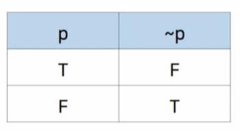
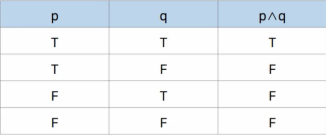

# 2강 - 논리

# `학습개요`

### 학습 목표

- 명제를 이해하고 진릿값을 판별할 수 있다.
- 논리연산자를 이용해 합성명제를 만들고 그 진릿값을 판별할 수 있다.
- 논리적 동치를 이해하고 동치인 명제를 작성할 수 있다.

### 학습 내용

- 명제
- 조건명제
- 논리적 동치

# `진릿값과 명제/논리연선자`

#### 진릿값 : 참(true : T)이나 거짓(false : F)을 가리키는 값

#### 명제 :

- `객관적인 기준`으로 진릿값을 구분할 수 있는 문장이나 수식
- 영어 소문자 p, q, r ...로 표현

### 부정(NOT) : ~p 또는 

- 문장 p가 명제일 때 "p가 아니다"를 의미
- p의 진릿값과 반대의 진리값을 갖는 명제
- 명제 ~p는 "p가 아니다.", "not p" 혹은 "p의 부정"으로 읽음
- 부정 진리표 

### 논리곱(AND) : p^q

- 문장 p,q가 명제일 때 "p 그리고 q" 를 의미하는 명제
- p, q의 진리값이 모두 참(T)일 때 참(T)이 되고, 그렇지 않을 때는 거짓(F)이 되는 명제
- 두 개의 명제를 결합하는 이항연산자, '그리고'의 의미를 가짐
- 명제 P^q는 "p 그리고 q"혹은 "p and q"라고 읽음
- 논리곱 진리표

### 논리합(OR) : 

- 문장 p,q가 명제일 때 "p 또는 q" 를 의미하는 명제
- p, q의 진리값이 둘 중 어느 하나라도 참(T)일 때 참(T)이 되고, 모두 거짓일 때는 거짓(F)이 되는 명제
- 두 개의 명제를 결합하는 이항연산자, '또는'의 의미를 가짐
- 명제 는 "p 또는 q"혹은 "p or q"라고 읽음
- 논리합 진리표

### 배타적 논리합(Exclusive OR : XOR) : 

- 문장 p,q가 명제일 때 명제 p,q의 진리값 둘 중 하나만 참(T)일 때 참(T)이 되고, 그렇지 않을 때는 거짓(F)이 되는 명제
- 명제 는 "p XOR q"라고 읽음
- 배타적 논리합 진리표 

# `합성/항진/모순/사건 명제`

### 합성명제(Compound Proposition)

- 하나이상의 명제들이 논리연산자에 의해 결합된 명제
- 논리연산자의 우선순위
-  

### 합성명제는 진릿값에 따라 세 종류로 나눔

- 항진명제 : T 
  - 합성명제를 구성하는 단일명제의 진릿값에 상관없이 합성명제의 진릿값이 항상 참(T)인 명제
- 모순명제 : F
  - 합성명제를 구성하는 단일명제의 진릿값에 상관없이 합성명제의 진릿값이 항상 거짓(F)인 명제
- 사건명제
  - 항진명제도 모순명제도 아닌 합성명제
-  

# `조건/쌍방조건 명제`

### 조건명제 / 함축 : 

- 문장 p,q가 명제일 때, 명제 p가 가정 또는 전제이고, 명제 q가 결론 또는 결과가 되는 명제
- p이면 q임
- p는 q를 함축함
- 조건명제 진리표

### 쌍방조건명제 : 

- 문장 p,q가 명제일 때, 명제 p와 q가 가정이면서 동시에 결론인 명제
- 쌍방조건명제 진리표

 

# `역, 이, 대우`

- 조건명제 에 대해 역은 가정과 결론이 바뀐 

- 조건명제 에 대해 이는 가정과 결론을 각각 부정한 
- 조건명제에 대해 대우는 가정과 겨론을 바꾸고 각각 부정한  

### 역, 이 , 대우의 진리표

 

 

# `논리적 동치법칙`

#### 논리적 동치

- 두 개의 명제p와 q의 진릿값이 서로 같은 경우

 

### 논리적 동치법칙

 

 

