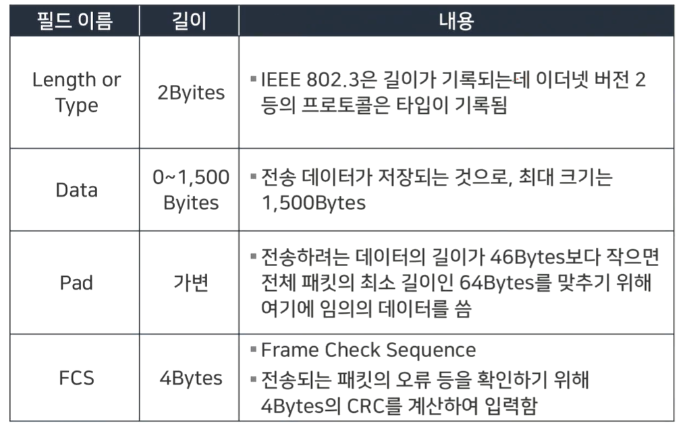
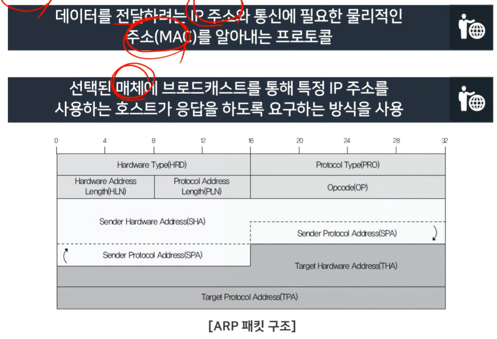
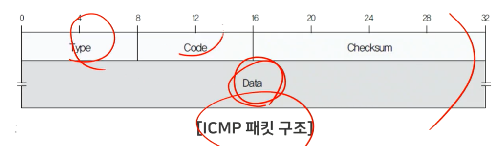
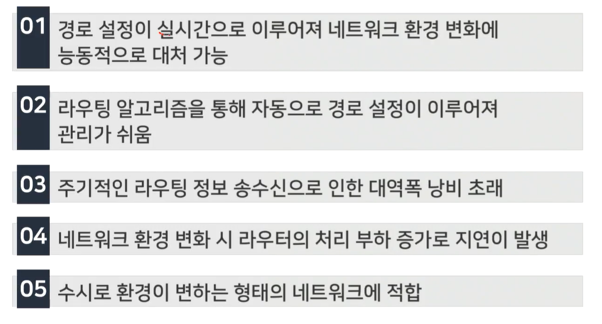

# 1강 - 네트워크의 이해

# `학습 개요`

### 학습 목표 

- 유무선 네트워크에 대해 설명할 수 있다.
- 네트워크 계층 구조에 대하여 설명할 수 있다.

### 학습 내용

- 네트워크
- 네트워크 계층 구조

## `생각해보기`

# `네트워크 관련 기초 용어`

### 네트워크 기초 용어

- 시스템, 인터페이스, 전송 매체, 프로토콜, 네트워크, 인터넷, 표준화
- 네트워크
  - 전송 매체로 서로 연결된 시스템의 모음
  - 
- 시스템
  - 내부 규칙에 따라 능동적으로 동작하는 대상
  - ex) 컴퓨터, 자동차, 커피 자판기, 마이크로 프로세서, 운영체제, 프로세스
- 인터페이스
  - 시스템과 전송 매체의 연결 지점에 대한 규격
  - 어떻게, 무엇을 주고 받을것이냐
    - ex) RS-232C, USB
- 전송매체
  - 시스템끼리 데이터를 전달하기 위한 물리적인 전송 수단
- 프로토콜
  - 전송 매체를 통해 데이터를 교환할 때의 임의의 통신 규칙
  - 상호 협약된 하나의 약속
  - 프로토콜에서 정의하고 있는 타입을 하나하나 맞춰야함
- 인터넷
  - 전세계의 네트워크가 유기적으로 연결되어 동작하는 통합 네트워크
  - 공통기능 : IP(Internet Protocol) -> IP/ICP
- 표준화
  - 서로 다른 시스템이 상호 연동해 동작하기 위한 통일된 연동 형식

# `시스템 기초 용어`

### 시스템의 구분

- 노드 
  - 인터넷에 연결된 시스템의 가장 일반적인 용어
- 호스트
  - 컴퓨팅 기능이 있는 시스템
- 클라이언트
  - 서비스를 요청하는 시스템 -> 프론트엔드
- 서버
  - 서비스를 제공하는 시스템 -> 백엔드

### 클라이언트와 서버

- 주어진 상황에 맞춰 서버가 클라이언트가, 클라이언트가 서버가 될 수도 있다.

# `네트워크의 기능`

### ISO의 OSI(Open System Interconnection) 7계층 모델

- 시스템끼리 어떻게 상호 유기적으로 연동할것인가에 대한 방법을 정의, 모델링해놓은것
- 조금 더 빠르게, 생산적으로 연결하기 위함
- 
- 물리계층 : 물리적으로 데이터를 전송하는 역할을 수행
  - 근본적으로 전기적(전기신호가) 송수신 하는 계층
- 데이터 링크 계층 : 물리적 전송 오류를 해결(오류 감지/재전송 기능)
  - 오류를 감지하고, 오류가 있다면 재전송하는 기능
- 네트워크 계층 : 올바른 전송 경로를 선택 (혼잡 제어 포함)
  - 어떤 경로가 더 효율적일지 선택 - 병목현상 파악, 해소
- 전송 계층 : 송수신 프로세스 사이의 연결 기능을 지원
  - 송신, 수신 노드 사이의 연결 기능
- 세션 계층 대화 개념을 지원하는 상위의 논리적 연결을 지원
- 표현 계층 : 데이터의 표현 방법
  - 논리적 연결이 되었을때 표현 방법
- 압축 : 전송되는 데이터의 양
- 암호화 : 전송되는 데이터의 의미
- 응용계층 : 다양한 응용 환경을 지원
  - 위의 두가지 기능을 포함해서 응용계층으로

### 프로토콜과 인터페이스

- 프로토콜 : 서로 다른 호스트에 위치한 동일 계층끼리의 통신 규칭

- 인터페이스 : 같은 호스트에 위치한 상/하위 계층 사이의 규칙
- 서비스 : 하위 계층이 상위 계층에 제공하는 인터페이스

### 인터넷 계층 구조

### 네트워크 계층(IP프로토콜), 전송계층(TCP, UDP 프로토콜)

### 인터네트워킹

- 네트워크의 연결
- 

- 게이트웨이(서버) : 인터네트워킹 기능을 수행하는 시스템
- 리피터 : 물리 계층을 지원(신호 증폭) (거리가 길어질때 감소된 신호를 증폭시켜줌)
- 브리지 : 물리 계층과 데이터 링크 계층을 지원
- 라우터 : 물리계층, 데이터 링크 계층, 네트워크 계층을 지원 (경로)

### 프로토콜

- 데이터 단위
  - 

# `네트워크 주소의 표현`

### 주소와 이름

- IP주소 

  - IPv4프로토콜에서 사용
  - 32비트 크기의 주소 체계
  - IPv6에서는 128비트 주소 체계로 확장
  - 
  - 라우터의 경로 선택
  - 

- 호스트 이름

  - 호스트 이름(URL)과 IP주소의 변환

    - 

    - 호스트 이름으로 응답 요청하면 상위계층에서 DNS로 호스트 이름을 보내 IP주소를 요청하고

      받아온 IP주소를 다시 반환한다

  - <호스트>.<단체 이름>.<단체 종류>.<국가 도메인>

- 호스트 파일

  - 호스트 이름과 IP주소의 조합을 텍스트 파일로 처리
  - 

# `프로토콜`

### 프로토콜(Protocol)의 정의

- 본래 의미는 왹에서 의례 또는 의정서
- 컴퓨터와 컴퓨터 사이에서 메시지를 전달하는 과정
  - ex) 통역원을 통해 이야기를 나누는 두 대통령

### 프로토콜의 3가지 요소

- 구문(Syntax) : 데이터의 구조나 포맷을 읨
- 의미(Sementics) : 전송되는 데이터의 각 부분이 무엇을 뜻하는지 알 수 있게 미리 정해 둔 규칙
  - 데이터 자체 뿐만 아니라 오류 제어, 동기 제어, 흐름 제어를 포함
- 순서(Timing) : 어떤 데이터를 보낼 것인지와 얼마나 빠르게 데이터를 보낼 것인지 정의

### 프로토콜의 기능

- 주소 설정(Addressing) : 서로 다른 시스템의 두 개채가 통신을 하는 경우 필요
- 순서 제어(Sequence Control) 
  -  프로토콜 데이터 단위를 전송할 때 보내는 순서를 명시하는 기능(연결 지향형(Connection-Oriented)에서만 사용)
- 데이터 대열의 단편화 및 재조합(Fragmentation & Reassenbly)
  -  대용량 파일을 전송할 때 전송 효율이 높은 작은 단위로 나누어 전송한 뒤 전송 받은 시스템에서 이를 재조합 해야 함
- 캡슐화(Encapsulation) : 데이터에 제어 정보를 덧붙이는 것
- 연결 제어(Connection Control) : 연결 설정, 데이터 전송 ,연결 해제에 대한 통제 수행
- 흐름 제어(Flow Control) : 송신측 개체로부터 오는 데이터의 양이나 속도를 조절하는 기능
  - 송신측과 수신측의 속도 차이 등으로 인한 정보 유실을 방지
- 오류 제어(Error Control) 
  - 두 개체에서 데이터를 교환할 때 SDU나 PCI가 잘못되었을 경우, 이를 발견하는 기법(순서를 검사하거나 특정 시간 안에 받지 못하면 재전송을 요구하는 방식으로 이루어짐)
- 동기화(Synchronization) 
  -  두 개체 간에 데이터를 전송할 때 각 개체는 특정 타이머 값이나 윈도우 크기 등을 통해 동시에 정의된 인자 값을 공유하는 것
- 다중화(Multiplexing) : 통신 선로 하나에서 여러 시스템을 동시에 통신할 수 있는 기법
- 전송 서비스 : 우선순위 결정, 서비스 등급과 보안 요구 등을 제어하는 서비스

# `네트워크 계층 구조`

### 네트워크 계층화에 대한 이해

- 1980년대 초 ISO는 여러 업체가 만든 시스템에 대해 상호연동이 가능한 표준 네트워크 모델을 재정할 필요성을 인식
- 1984년 OSI 네트워크 모델 발표
- 

## OSI 7계층

#### 1계층(물리 계층)

- 실제 장치를 연결하는 데 필요한 전기적, 물리적 세부 사항을 정의
  - 허브, 리피터

#### 2계층(데이터 링크 계층)

- 점대점(Point-to-Potint) 사이의 신뢰성 있는 전송을 보장하기 위한 계층(전송의 품질 중요)
- CRC기반의 오류 제어와 흐름 제어가 필요
  - 이더넷

#### 3계층(네트워크 계층)

- 여러 노드를 거칠 때마다 경로를 찾아주는 역할
- 라우팅, 흐름 제어, 단편화 (Segmentation/Desegmentation), 오류 제어등을 수행
  - 라우터 : 이 계층에서 동작하는 스위치(L3스위치)

#### 4계층(전송 계층)

- 양 끝단 사용자들이 신뢰성 있는 데이터를 주고받을 수 있게 하여 상위 계층이 데이터 

  전달의 유효성이나 효율성을 고려하지 않아도 되게 해 줌

- 전송 계층에서 동작하는 프로토콜 중 TCP는 연결 지향(Connection-Oriented) 프로토콜

#### 5계층(세션 계층)

- 양 끝단의 응용프로세스가 통신을 관리하기 위한 방법을 제공

- 동시 송수신 방식(Duplex), 반이중 방식(Half-Duplex), 전이중 방식(Full-Duplex)의

   통신과 함께 체크 포잍이과 유휴,종료, 제작 과정 등을 수행

- TCP/IP 세션(연결 상태)을 만들고 없애는 책임을 짐

#### 6계층(표현 계층)

- 시스템에서 사용되는 코드 간의 번역을 담당
- 데이터 압축과 암호화 기능 수행

#### 7계층(응용 계층)

- 사용자나 응용 프로그램 사이에 데이터 교환을 가능하게 하는 계층
- HTTP, FTP, 터미널 서비스, 메일 프로그램, 디렉토리 서비스 등을 제공

# `물리 계층`

### 1계층 : 물리 계층(Physical Layer)

- 시스템 간의 연결선(흔히 랜(Lan)을 뜻함)
  - 보통 랜 케이블 : CAT 5의 10/100 BASE-T(IEEE 802.3), CAT 6의 10/1000 BASE-T(IEEE 802.3)
  - 전화선 : CAT1

### CAT별 특성

### 케이블의 구분

- UTP(Unshielded Twisted Pair)

  - 두 선 간의 전자기 유도를 줄이기 위해 절연의 구리선이 서로 꼬여 있는 것으로, 제품 전선과 피복만으로 구성

- FTP(Foil Screened Twisteed Pair)

  - 알루미늄 은박이 4가닥 선을 감싸고 있는 것으로, UTP보다 절연 기능이 탁월해 공장 배선용으로 많이 쓰임

- STP(Shielded Twisted Pair)

  - 연선으로 된 케이블 겉에 외부 피복, 또는 차폐재가 추가(쉴드 처리)된 것으로, 차폐재가 접지 역할을 하므로

    외부 노이즈를 차단하거나 전기적 신호 간섭을 줄이는 데 탁월함\

### 커넥터

### 리피터(Repeater)

- 네트워크를 연장하기 위한 장비
- 불분명해진 신호 세기를 다시 증가시키는 역할
- 최근에는 리피터가 모든 네트워크 장비에 공통으로 들어가는 기능이 됨

### 허브(HuB)

- 요즘 쓰이는 스위치의 예전 형태
- 

# `데이터 링크 계층`

### 2계층 : 데이터 링크 계층(Data Link Layer)

- 랜 카드난 네트워크 장비의 하드웨어 주소(MAC주소)만으로 통신하는 계층
- 네트워크 카드의 MAC주소는 윈도우 명령 창에서 'ipconpig /all' 명령을 실행하면 'Physical Address'에서 확인 가능
- 

### MAC 주소

- 총 12개의 16진수로 구성
- 앞쪽 6개 : 네트워크 카드를 만든 회사(OUI)
- 뒤쪽 6개 : 호스트 식별자(Host Identifier)
  - 각 회사에서 임의로 붙이는 일종으 ㅣ시리어
- 같은 MAC주소는 존재하지 않음

### X.25

- ITU-T(구 CCITT)에 의해 1980년경부터 규격화된 통신 규약
- 단말장치(DTE)와 회선종단장치(DCE)간의 통신 절차를 규정한 계층화 된 프로토콜
- 
- 가장 일반적인 회선종단장치는 모뎀, 단말장치는 컴퓨터
- X.25의 운용속도는 T1/E1급 정도

### 프레임 릴레이(Frame Relay)

- 불필요한 전송 오류제어나 흐름 제어 등 복잡한 기능을 최소화화고, 망 종단 장치에서 처리하도록 하여

  고속 전송을 실현하는 고속 데이터 전송 기술

  - X.25 패킷 교환망의 10배가지 고속 데이터 전송이 가능

### ATM(Asnchronous Transfer Mode)

- 고속의 데이터를 53Byte 셀로 처리하는 VLSI 기술
- 실시간 영상 전속와 같은 고속 통신에 사용

### 이더넷

- 제록스의 PARC(Palo Alot Research Center)에서 1970년대에 개발한 데이터 링크 계층의 프로토콜
- 이더넷 패킷의 최소 길이는 64KBytes, 최대 길이는 1,518KBytes
- 이더넷은 1980년대에 발표된 IEEE 802.3이 규약의 기초가 됨
- 
- 
- 

### 브리지(Bridge)

- 랜과 랜을 연결하는 초기의 네트워크 장치
- 데이터 링크 계층에서 통신 선로를 따라서 한 네트워크에서 그 다음 네트워크로 데이터 프레임을 복사하는 역할

### 스위치

- 기본적으로 데이터 링크 계층에서 작동하는 스위치를 뜻함

- L2스위치 : 연결된 시스템이 늘어날수록 패킷 간 충돌 때문에 

  매우 낮은 속도로 동작하는 더미 허브의 문제점을 해결하는 획기적인 방안

### 스위칭 방식

- 컷스루 방식
  - 수신한 프레임의 목적지 주소를 확인하고 목적지 주소의 포트로 프레임을 즉시 전송하여 지연 시간을 최소화
  - 수신한 패킷에 오류가 발생할 때는 목적지 장치에서 해당 패킷을 폐기
- 저장 후 전송 방식
  - 전체 프레임을 수신하여 버퍼에 보관했다가 CRC등의 오류를 확인하여 정상 프레임을 목적지 포트로 전송
  - 패킷 길이에 비례해 전송 지연이 발생하지만 브리지나 라우터보다 신속
  - 속도가 서로 다른 포트를 연결할 경우 반드시 사용
  - 최근에는 컷스루와 저장 후 전송 방식을 동시에 지원하는것이 일반적임
- 인텔리전트 스위칭
  - 보통 컷스루 모드로 작동하다가 오류가 발생하면 저장 후 전송 모드로 자동 전환하여 오류 프레임 전소 중지
  - 오류율이 0이 되면 자동으로 컷스루 방식으로 전환
- 제공하는 경로의 대역폭에 따른 구분
  - 반이중 방식
    - 양방향 통신 기능을 제공하지만 한 번에 하나의 동작(송신 또는 수신)만 가능
  - 전이중 방식
    - 송싱 포트와 수신 포트를 분리해 반이중 방식보다 성능이 두배로 뛰어남
    - 충돌이 없어서 전송 거리의 제한을 연장할 수 있음
    - 기술적으로는 스위치에서만 전이중 방식을 지원할 수 있음

### 스위치 테이블

- 시스템간 원활한 통신을 위해 주소 테이블을 생성하고 관리하는 역할
- 

# `네트워크 계층`

- 랜을 벗어난 총신을 하기 위해 네트워크 계층에서 IP 주소를 사용

### ARP(Address Resolution Protocol)

### RARP(Reverse Address Resolution Protocol)

- 디스크가 없는 호스트가 자신의 IP주소를 서버로부터 확인하는 프로토콜
- 일반적으로 자체의 디스크 기억 장치가 없는 워크스테이션이나 지능형 단말기에서 사용	

### IP(Internet Protocol)

- 가장 대표적인 네트워크 계층의 프로토콜
- 하위 계층의 서비스를 이용하여 두 노드 간의 데이터 전송 경로를 확립해주는 역할(단말장치 간 패킷 전송 서비스)
- 
- 
- 
- 
- 
- 32자리 2진수로 8자리마다 점을 찍어 구문
- A, B, C, D, E클래스로 구분, 각 클래스는 네트워크 부분과 호스트 부분으로 구성
- A, B, C 클래스는 맨 앞부분에 시작하는 2진수 숫자에 따라 구분
- 
- 
- 사설 네트워크는 공인 네트워크 주소 부족 현상을 해결하기 위해 많이 사용
- 

### ICMP(Internet Control Message Protocol)

- 호스트 서버와 인터넷 게이트웨이 사이에서 메시지를 제어하고 오류를 알려주는 프로토콜
- 대표적인 툴은 Ping
- 
- 
- 송신측의 전송 패킷이 목적이 노드나 라우터에 도착했는지를 확인하는데 사용
- 
- 
- 

### IGMP(Internet Group Management Protocol)

- 멀티캐스트에 관여하는 프로토콜로 멀티캐스트 그룹을 관리하는 역할
- 유니캐스트(Unicast) 
  - 한 호스트에서 다른 호스트로 전송하는 것
  - 일반적인 IP 데이터의 전송은 유니캐스트를 사용
- 브로드캐스트(Broadcast)
  - 호스트에서 IP네트워크에 있는 전체 호스트로 데이터를 전송하는것
- 멀티캐스트(Multicast)
  - 유니캐스트와 멀티캐스트의 중간형태
  - 송신하는 하나의 호스트에 특정한 호스트를 묶어서 전송하는것
  - 지정한 주소로 패킷을 한 번만 전달하면 멀티캐스트 그룹에 속한 모든 호스트에 전달되기 때문에 효율이 높음
  - IP 멀티캐스트 주소는 D클래스 주소 대역(244.0.0.1 ~ 239.255.255.255)로 규정

### 라우터

- 라우팅 테이블에서 직접 구체적으로 지정한 주소 외의 모든 목적지 주소는 192.168.0.100 인터페이스를 통해 게이트웨이 192.168.0.1로 보내라는 의미
- 
- 

### 정적 라우팅

- 관리자 권한으로 특정 경로를 통해서만 패킷 지날 수 있도록 설정
- 네트우크 변경사항이 발생하면 라우팅 테이블을 수동으로 고침
- 보안이 중요한 경우 선호
- 
- 

### 동적 라우팅

- 라우터가 네트워크 연결 상태를 스스로 파악하여 최적의 경로로 전송
- 네트워크 연결 형태가 변경되어도 자동으로 문제를 해결
- 
- 
- 

### 정적/동적 라우팅 비교

# `전송 계층`

### 4계층 : 전송 계층(Trnsport Layer)

- 대표 프로토콜은 TCP(transmission Control Protocol)
- TCP가 가진 주소를 포트(port)라 하며 0~65535(216-1)번까지 존재
- 0~1023번(1,024)을 잘 알려진 포트(Well Known Port)라고 부름 보통 0번 포트는 사용하지 않음
- 

### 패킷 구조와 예

### TCP(Transmission Control Protocol)

- 연결 지향형 프로토콜
- IP와 함께 통신을 하는 데 반드시 필요한 가장 기본적인 프로토콜

### TCP의 특징

### TCP 패킷의 내용

### 연결 설정 과정

- SYN + ACK 과정

### 연결 해제 과정

- FYN + ACK 과정

### UDP(User Datagram Protocol)

- 비연결 지향형 프로토콜
- 상대방이 보낸 응답을 확인하지 않아 네트워크에 부하를 주지 않음
- 데이터 자체의 신뢰성이 없어 수신한 데이터의 무결성을 보장받지 못함

### UDP의 특징

- 비연결 지향형
- 네트워크 부하 감소
- 비신뢰성
- 전송된 데이터의 일부가 손실됨

### UDP 패킷의 내용

# `응용 계층`

### 응용 계층 프로토콜

