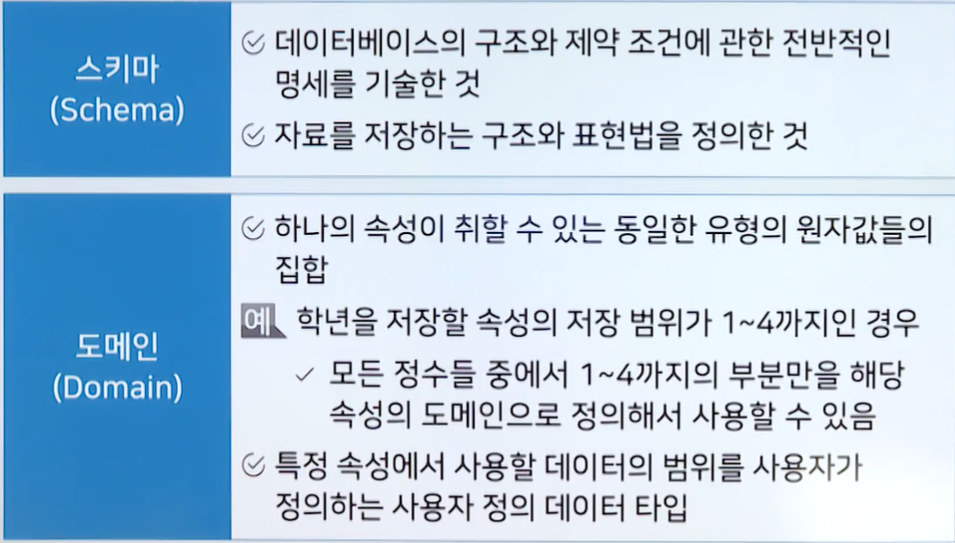
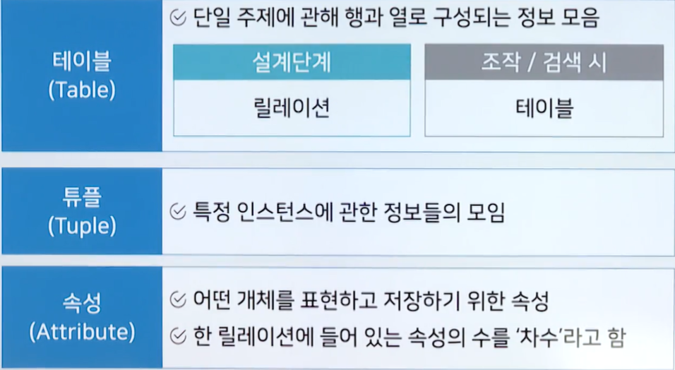
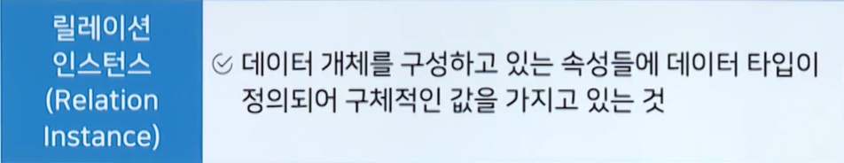
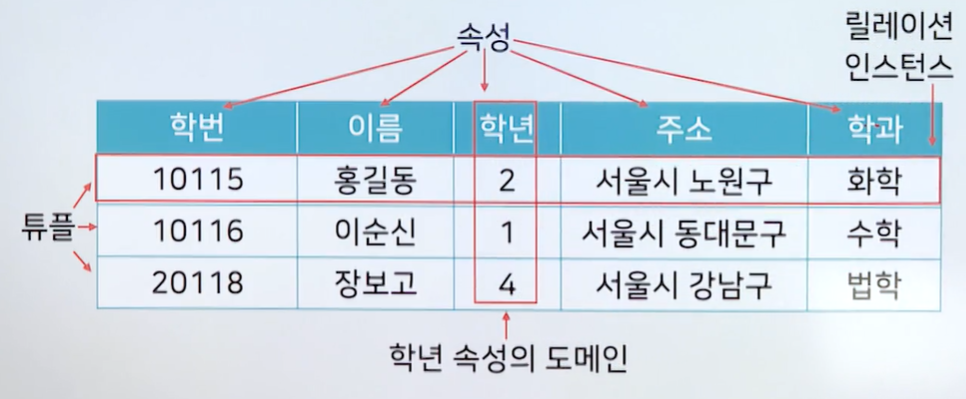
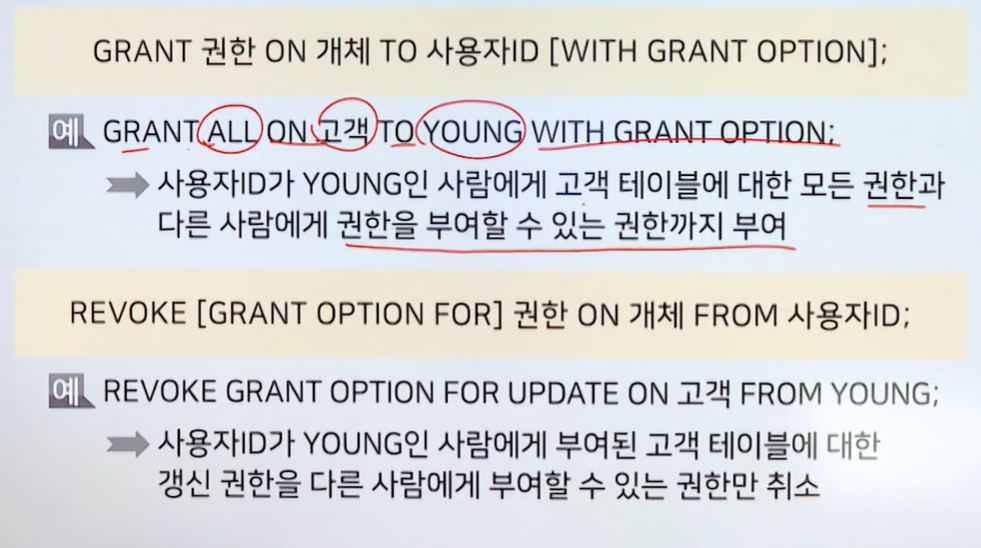
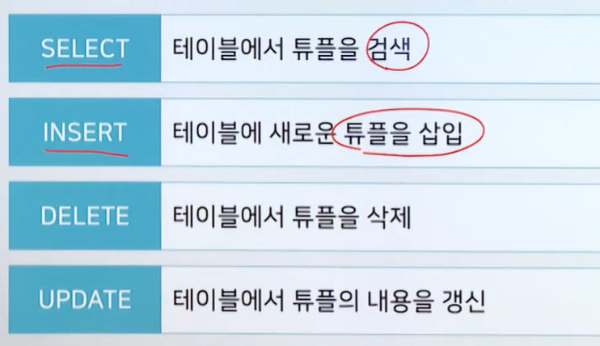

# 1강 - SQL 일반

# `학습개요`

### 학습 목표

- SQL의 용어 정의와 개념에 대하여 설명할 수 있다.
- SQL의 종류와 용도에 대하여 설명할 수 있다.
- SQL 명령어의 전반적인 구조에 대하여 설명할 수 있다.
- DDL, DCL, DML의 개념과 정의에 대하여 설명할 수 있다.

### 학습내용

- SQL일반
- DDL
- DCL
- DML

# `SQL의 정의`

### SQL(Structured Query Language)

- 구조화 질의어, 관계형 데이터베이스 관리 시스템의 데이터를 관리하기 위하여 설계된 특수 목적의 프로그래밍 언어
- ISO/IEC 9075
  - 국제 표준화 기구(ISO)와 미국 표준 협회(ANSI)에서 통합/개정한 것
  - SQL에 대한 국체 표준으로 활용되고 있음

### SQL 관련 용어 정리

# `DDL 개요`

### DDL(Data Define Language)

- DB의 구조, 데이터 형식, 접근 방식 등 DB를 구축하거나 수정할 목적으로 사용하는 언어
- DDL의 결과는 데이터 사전(Data Dictionary)라는 특별한 파일에 여러 개의 테이블로 저장됨

### DDL의 유형

CREATE

- SCHEMA, DOMAIN, TABLE, VIEW, INDEX를 정의

ALTER 

- TABLE에 대한 정의를 변경

DROP

- SCHEMA, DOMAIN, TABLE, VIEW, INDEX를 삭제

# `CREATE`

###  CREATE SCHEMA

- 스키마를 정의하는 명령문
  - CREATE SCHEMA `스키마이름` AUTHORIZATION `사용자명`;
  - ex) CREATE SCHEMA `학교` QUTHORIZATION `홍길동`;
    - 소유궈자의 ID가 `홍길동`인 스키마 `학교`를 정의하는 SQL문
- 도메인을 정의하는 명령문
  - CREATE DOMAIN `도메인이름``데이터타입`\[DEFAULT 기본값][CONSTRAINT 제약조건명 CHECK(범위값)]  -> 대괄호 안에 문장은 생략 가능
  - CREATE DOMAIN GRADE CHAR(1) \[DEFAULT 'B'] [CONSTRAINT TEST CHECK(VALUE IN('A','B'))]
    - 정의된 도메인은 이름이 `GRADE`이고 문자를 1개 가질 수 있는 데이터 타입
    - 도메인 `GRADE`가 지정된 속성은 기본값으로 "B"를 가지며 해당 도메인을 지정한 속성에는 'A','B' 둘 중 하나의 값만을 저장할 수 있음
- 테이블을 정의하는 명령문
  - CRATE TABLE `테이블이름` (속성이름 데이터타입\[DEFAULT 기본값] \[NOT NULL] [기타 추가 참조속성]...);
  - 테이블의 추가 참조 속성
    - PRIMARY KEY
      - 기본키로 사용할 속성을 지정 중복 될 수 없음
      - NULL일 수 없음
    - UNIQUE
      - 대체키로 사용할 속성을 지정
      - 중복된 값을 가질 수 없음
    - NOT NULL
      - NULL일 수 없음
    - FOREIGN KEY `속성` REFERENCES `테이블이름`
      - 외래키로 사용할 속성을 지정
    - ON DELETE
      - 참조 테이블의 튜픙리 삭제되었을 때 기본 테이블에 취해야 할 사항 지정
    - ON UPDATE
      - 참조 테이블의 참조 속성 값이 변경되었을 때 기본 테이블에 취해야 할 사항을 지정
        - CREATE TABLE `학생`(이름 VARCHAR(15) NOT NULL, 학번 CHAR(8), 전공 CHAR(5), 생년월일 DATE, PRIMARY KEY(전공) REFERENCES 학과(학과코드) ONDELETE SET NULL);
- 뷰를 정의하는 명령문
  - 뷰
    - 하나 이상의 기본 테이블로부터 유도되는 가상 테이블
    - 실제로는 데이터가 저장되는 것은 아님
    - CREATE VIEW `뷰이름`[속성이름, ..] AS SELECT문;
    - ex) CREATE VIEW `서울고객`(성명, 전화번호), AS SELECT `성명`, `전화번호` FROM `고객` WHERE `주소` = `"서울시"`;
      - 고객 테이블에서 주소가 서울시인 고객들의 성명과 전화번호를 `서울고객`이라는 이름의 뷰로 정의
- 인덱스를 정의하는 명령문
  - 인덱스
    - 검색 시간을 단축시키기 위해 만든 보조적인 데이터 구조
  - CREATE [UNIQUE] INDEX `인덱스 이름` on `테이블이름` [(속성명 ASC|DESC)];
    - ex) CREATE UNIQUE INDEX `고객번호`)_idx ON `고객`(고객번호 DESC);
      - 고객 테이블에서 UNIQUE한 특성을 갖는 고객번호 속성에 대해 내림차순으로 정렬하여 고객번호_idx라는 이름으로 인덱스를 정의

# `ALTER와 DROP`

### ALTER TABLE

- 테이블에 대한 정의를 변경하는 명령문
- 새로운 속성을 추가할 때 사용
  - ALTER TABLE `테이블이름` ADD `속성이름` 데이터타입[DEFAULT 기본값];
    - ex) ALTER TABLE `학생` ADD `학년` VARCHAR(3);
      - 학생 테이블에 최대 3문자까지 저장할 수 있는 학년 속성을 추가
- 기존 속성을 변경할 때 사용
  - ALTER TABLE `테이블이름` ALTER `속성이름`  데이터타입 [SET DEFAULT 기본값];
    - EX) ALTER TABLE `학생` ALTER `학번` VARCHAR(10) NOT NULL
      -  학생 테이블의 `학번` 필드의 데이터 타입과 크기를 VARCHAR(10)으로 변경하고 NULL 값이 입력되지 않도록 변경
- 기존 속성을 삭제할 때 사용
  - ALTER TABLE `테이블이름` DROP COLUMN 속성이름 [CASCADE];

### DROP

- 스키마, 도메인, 기본 테이블, 뷰테이블, 인덱스, 제약 조건 등을 제거
- DROP SCHEMA `스키마이름 `[CASCADE|RESTRICT];
- DROP DOMAIN `도메인이름` [CASCADE|RESTRICT];
- DROP TABLE `테이블이름` [CASCADE|RESTRICT];
  - EX) DROP TABLE `학생` CASCADE;
    - 학생 테이블을 제거하되 학생 테이블을 참조하는 모든 데이터를 함께 제거(CASCADE)
- DROP VIEW 뷰이름 [CASCADE|RESTRICT];
- DROP INDEX 인덱스이름 [CASCADE|RESTRICT];
- DROP CONSTRAINT 제약조건이름;
- CASCADE : 제거할 요소를 참조하는 다른모든 개체를 함께 제거
- RESTRICT : 다른 개체가 제거할 요소를 참조 중일 때는 제거를 취소

# `DCL 개요`

### DCL(Data Control language, 데이터 제어어)

- 데이터의 보안, 부결성, 회복, 병행 제어 등을 정의하는 데 사용하는 언어

- 데이터베이스 관리자가 데이터 관리를 목적으로 사용함

- COMMIT : 명령에 의해 수행한 결과를 실제 물리적 디스크로 저장
- ROLLBACK : 작업이 비정상적으로 종료된 경우 원상태로 복구
- GRANT : 사용자에게 데이터베이스 사용 권한을 부여
- REVOKE : 데이터베이스 사용자의 권한을 취소

# `GRANT/REVOKE`

### GRANT

- 권한 부여를 위한 명령어
  - GRANT `사용자등급` TO `사용자ID` [IDENTIFIED BY 암호];

## REVOKE

- 권한 취소를 위한 명령어
  - REVOKE `사용자등급` FROM `사용자ID`

### 사용자 등급의 종류

- DBA : 데이터베이스 관리자
- RESOURCE : 데이터베이스 및 테이블 생성 가능자
- CONNECT : 단순 사용자
  - EX) GRANT RESOURCE TO YOUNG
    - 사용자 ID YOUNG인 사람에게 데이터베이스 및 테이블 생성할수있는 권한 부여
- GRANT `권한` ON `개체` TO `사용자ID` [WITH GRANT OPTION];
- REVOKE [GRANT OPTION FOR ] `권한` ON `개체` FROM `사용자ID`;
- 권한의 종류
  - ALL
  - SELECT
  - INSERT
  - DELETE
  - UPDATE
  - ALTER
- WITH OPTION FOR : 부여 받은 권한을 다른 사용자에게 부여할 수 있는 권한
- GRANT OPTION FOR : 다른 사용자에게 권한을 부여할 수 있는 권한을 취소
- CASCADE : 권한 취소 시 권한을 부여 받았던 사용자가 다른 사용자에게 부여한 권한도 취소
  - 

# `COMMIT/ROLLBACK`

### COMMIT

- 트랜잭션이 수행된 내용을 데이터 베이스에 반영하는 명령
- AUTO COMMIT 기능이 설정되어 있을 경우
  - DML문이 성공적으로 완료되었을 때 자동으로 COMMIT 할 수 있음

### ROLLBACK

- 변경되었으나 COMMIT 되징 않은 모든 내용들을 취소하고 데이터베이스를 이전 상태로 되돌리는 명령
- 일부 변경된 내용만 데이터베이스에 반영되게 되면 비일관성 상태가 발생할 수 있어 일부분만 완료된 트랜잭션은 롤백되어야 함

### SAVEPOINT

- 트랜잭션 내에 ROLLBACK할 위치인 저장점을 지정하는 명령
- 저장점을지정할 때에는 이름을 부여
- 저장점 이전까지의 처리 내용이 모두 취소
  - EX) SAVEPOINT SP;
    - DELETE FROM `학생` WHERE `학번` = 1122;
    - ROLLBACK SP;

# `DML 개요`

### DML(Data Manipulation Language, 데이터 조작어)

# `INSERT, DELETE FROM, UDATE SET`

### INSERT

- 테이블에 새로운 튜플을 삽입
- 대응하는 속성과 데이터는 개수와 데이터 유형이 일치해야 함
- 모든 속성을 사용하는 경우 속성명을 생략할 수 있음
- SELECT문을 사용하여 다른 테이블의 검색 결과를 삽입할 수 있음
- INSERT INTO`테이블이름`(속성1, 속성2, ...) VALUES (데이터1, 대이터2,....);
  - EX) INSERT INTO `학생(이름,학과)` VALUES('이영준','컴퓨터공학');
    - 학생 테이블에 이름과 학과 속성에 지정된 값으로 튜플을 추가

### DELETE

- 기본 테이블에 있는 튜플들 중에서 특정 튜플을 삭제
- DELETE FROM `테이블 이름` [WHERE 조건]
- WHERE 절이 생략된 경우 해당 테이블의 모든 튜플이 삭제됨
- DROP은 테이블 자체가 삭제되는것이고 DELETE는 테이블의 구조는 남아있음
  - EX) DELETE FROM `학생` WHERE `이름` = '이영준';
    - 학생 테이블에서 이름 속성값이 '이영준'인 튜플을제거

### UPDATE SET

- 특정 튜플의 내용을 변경할 때 사용
- UPDATE `테이블이름` SET `속성명` = 데이터[WHERE 조건];
- WHERE부분이 생략된 경우 테이블 전체 튜플의 해당 속성값이 갱신
- UPDATE `학생` SET `주소` = '종로구' WHERE `이름` = '이영준'
  - 학생 테이블에서 이름이 '이영준'인 튜플의 주소 속성값을 '종로구'로 변경하라
- UPDATE `급여` SET `부서` = '개발', 기본급 = 기본급 + 10 WHERE 이름 = "이영준"
  - 급여 테이블에서 이름이 이영준인 튜프르이 부서를 개발로 바꾸고 기본급을 원래 값에서 10을 추가한 값으로 변경

