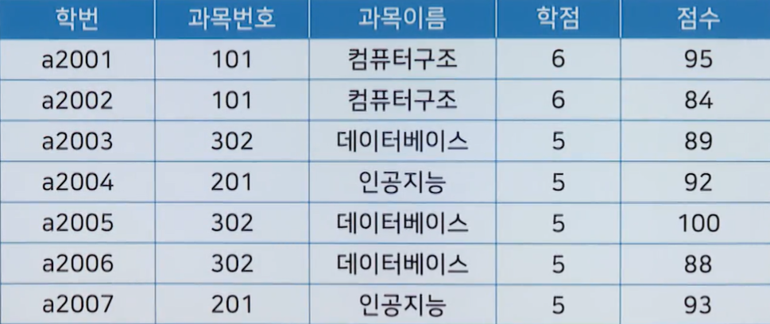

# 2강 - SQL응용

# `학습개요`

### 

# `기본형태`

### SELECT 

- 데이터베이스 내부의 자료를 확인할 수 있는 명령
- SELECT 속성이름 FROM 테이블 이름;
  -  

- 위의 테이블에서 이름과 학년에 관한 자료만을 확인하려 하는 경우 다음과 같은 명령어를 사용함
  - SELECT 이름, 학년, FROM 학생;
  -  
- 속성 부분에 *을 찍으면 모든 속성을 다 조회할 수 있음
  - SELECT * FROM 학생;
  -  

# `SELECT의 명령어`

### DISTINCT

- 해당 속성에서 중복되는 자료를 보이지 않도록 출력하는 명령어
- SEELCT [DISTINCT] 속성이름 FROM 테이블이름;
  -  
- SELECT DISTINCT 학년 FROM 학생;
  -  

### AS

- 출력시 해당 속성의 명칭을 변경하는 명령어
- SELECT 속성이름 [AS 변경이름] FROM 테이블이름;
- SELECT 이름 AS "성명", 학과 AS "전공" FROM 학생;
  -  

# `조건을 통한 검색`

### WHERE

- 검색어에 조건을 달 수 있는 기능
- SELECT 속성이름 FROM 테이블이름 [WHERE 검색조건];
  -  
- SELECT 이름, 학년 FROM 학생 WHERE 학과 = "컴퓨터공학"
  -  

### 조건이 여러가지인 경우

- AND : 양쪽 조건이 모두 만족하는 경우
- OR : 양쪽 조건 중 하나라도 만족하는 경우
- SELECT 이름, 학년 FROM 학생 WHERE 학년 > 2 AND 학과 = "컴퓨터공학";
  -  
- SELECT 이름, 학년 FROM 학생 WHERE 학년 > 2 OR 학과 = "컴퓨터공학";
  -  

# `검색내용의 정렬 처리`

### ORDER BY

- 기준 속성의 값에 따라 데이터를 정렬하여 표기
- SELECT 속성이름 FROM 테이블이름 [WHERE 검색조건] [ORDER BY 기준속성 방식];
  -  

- ASC 방식 : 값을 기준으로 오름차순 정렬
- DESC 방식 : 값을 기준으로 내림차순 정렬
- SELECT 이름, 학년 FROM 학생 ORDER BY 학년 DESC;
  -  

# `GROUP BY`

### GROUP BY

- 지정된 속성으로 그룹을 만들 때 사용하며 생성된 그룹은 그룹함수를 사용시 활용
  - COUNT(속성이름) : 그룹별 튜플의 수를 구할 때 사용
  - SUM(속성이름) : 그룹별 값의 합계를 구할 때 사용
  - MIN(속성이름) : 그룹내의 최소값을 구할 때 사용
  - MAX(속성이름) : 그룹내의 최소값을 구할 때 사용
  - AVG(속성이름) : 그룹별 평균을 구할 때 사용
-  
- SELECT * FROM 학생 GROUP BY 학과;
  -  
- SELECT 학과, COUNT(*) AS "학과별인원" FROM 학생 GROUP BY 학과
  -  

# `HAVING`

### HAVING

- 특정 컬럼을 그룹화한 결과에 조건을 걸때 사용하는 문법

- WEHRE : 그룹화 하기 전의 조건

- HAVING : 그룹화 후의 조건

-  

- SELECT 과목이름, MIN(점수) AS '최소점수', MAX(점수) AS '최대점수' FROM 성적 GROUP BY 과목이름 HAVING AVG(점수) >= 90;

-  

  

# `집합`

### 집합 연선자

- 2개 이상의 테이블의 데이터를 하난로 통합하여 조회
  - UNION :
    - 두 SELECT문의 조회결과를 통합하여 출력
    - 중복된 행은 한번만 출력 (합집합)
  - UNION ALL : 
    - 두 SELECT문의 조회겨로가를 통합하여 출력
    - 중복된 행도 그대로 출력(합집합)
  - INTERSECT : 
    - 두 SELECT문의 조회겨과 중 공통된 행만 출력(교집합)
  - EXCEPT : 
    - 첫 번째 SELECT문의 조회 결과에서 두 번때 SELECT문의 조회 결과를 제외한 행을 출력(차집합)
-  
- SELECT * FROM 사원 UNION SELECT * FROM 직원
  -  

# `JOIN개요`

JOIN

- 2개의 릴레이션에 연관된 튜플들을 결합하여 데이터를 출력하는 명령어

- #### INNER JOIN : 특정 속성을 기준으로 하여 두 릴레이션을 연결하는 방식

  - EQUI JOIN 

    - 공통 속성을 기준으로 = 로 비교하여 같은 값을 가지는 행을 연결하여 결과를 생성하는 방법
    - SELECT 테이블1.속성명, 테이블2.속성명 FROM 테이블1, 테이블2 WHERE 테이블1.기준속성 = 테이블2.기준속성; JOIN ~ USING(기준속성)
    - - JOIN USING 이용하여 = 부분을 대체할 수 있음
    - SELECT 테이블1.속성명, 테이블2.속성명 FROM 테이블1 JOIN 테이블2 USING(기준속성);

  - NON EQUI JOIN

    - = 조건이 아닌 나머지 비교연산자를 이용하는 JOIN 방벅
    - SELECT 테이블1.속성명, 테이블2.속성명 FROM 테이블1, 테이블2 WHERE 조건;

    

  #### OUTER JOIN : JOIN조건에 만족하지 않은 튜플도 결과로 출력하기 위한 방법

- LEFT OUTER JOIN

  - INNER JOIN의 결과를 구함
  - 우측 항 릴레이션의 어떤 튜플과도 맞지 않는 좌측 항의 릴레이션에 있는 튜플들에 NULL값을 붙여서 결과를 표현
  - SELECT 테이블1.속성명, 테이블2.속성명 FROM 테이블1 LEFTOUTER JOIN 테이블2 ON 테이블1.기준속성 = 테이블2.기준속성

- RIGHT OUTER JOIN

  - INNER JOIN의 결과를 구함
  - 우측 항 릴레이션의 어떤 튜플과도 맞지 않는 좌측 항의 릴레이션에 있는 튜플들에 NULL값을 붙여서 결과를 표현
  - SELECT 테이블1.속성명, 테이블2.속성명 FROM 테이블1 RIGHTOUTER JOIN 테이블2 ON 테이블1.기준속성 = 테이블2.기준속성

- FULL OUTER JOIN

  - LEFT OUTER JOIN과 RIGHT OUTER JOIN을 합쳐둔 것
  - INNER JOIN의 결과를 구함
  - 좌측 항과 우측 항을 비교하여 맞지 않는 것들은 NULL을 붙여 표기

# `INNER JOIN`

 

#### EQUI JOIN

- SELECT 학번, 이름, 학생.학과코드, 학과명 FROM 학생, 학과 WHERE 학생.학과코드 = 학과.학과코드;
  -  

#### NON EQUI JOIN

- SELECT 학번, 이름, 학생.성적, 등급.성적 FROM 학생, 등급 WHERE 학생.성적 BETWEEN 등급.최저 AND 등급.최고;
  -  

# `OUTER JOIN`

#### LEFT OUTER JOIN

- SELECT 학번, 이름, 학생.학과코드, 학과명 FROM 학생 LEFT OUTER JOIN 학과 ON 학생.학과코드 = 학과.학과코드;
  -  

#### FULL OUTER JOIN

- SELECT 학번, 이름, 학생.학과코드, 학과명 FROM 학생 FULL OUTER JOIN 학과 ON 학생.학과코드 = 학과.학과코드;
  -  

