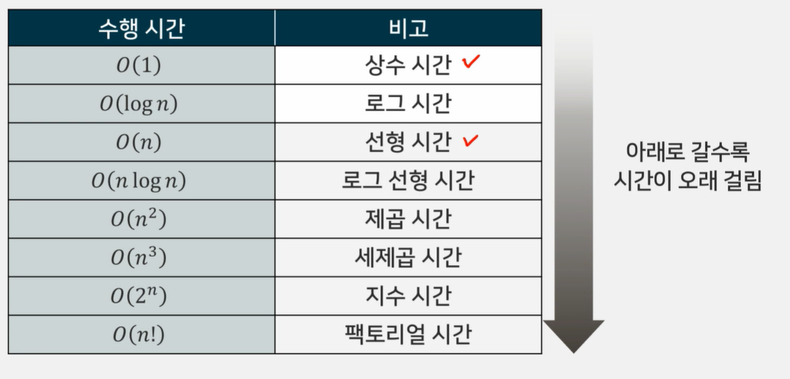

### 1강_코딩 테스트 소개

- 알고리즘 문제를 주고 코딩으로 해결하도록 요구하는 테스트
-  주어진 시간 내에 시간 제한과 메모리 제한을 만족하도록 코드를 작성해야 함

### 어떤 능력이 필요할까?

- 프로그래밍 언어 사용 능력(구현 능력)
  -  파이썬, C/C++등, 자바 등
- 자료구조와 알고리즘 지식
  - 자료구조 : 집합, 딕셔너리(맵), 스택, 큐, 덱, 유선순위 큐 등
  - 알고리즘 : 그리디, 다이나믹 프로그래밍 그래프 탐색
- 문제 해결 능력

### 파이썬

- 장점 
  - 다른 언어에 비해 짧은 코드로 프로그래밍 할 수 있음
  - 다른 언어에 비해 큰 수 처리, 문자열 처리에 편리함
  - 빅데이터쪽에서 강점을 보임
- 단점
  - C/C++에 비해 속도가 느린 편임

### 시간 복잡도와 공간 복잡도

- 시간 복잡도 : 코드의 수행 시간을 분석할 때 사용
- 공간 복잡도 : 코드의 메모리 사용량을 분석할 때 사용

### 시간 복잡도 - 빅오(Big-O) 표기법

- 크기 n의 모든 입력에 대한 알고리즘에서 필요한 시간이 최대 얼마인지를 점근적으로 나타내는 표기법

### 시간 제한과 메모리 제한

- 파이썬 : 통상 1초에 대략 2천 번의 연산이 가능함
- C / C++ : 통상 1초에 대략 1억번의 연산이 가능함

# 수업 계획 

###  수업 목표와 개요

- 중간고사 및 기말고사
  - C / C++을 사용하여 문제를 푸는것은 제외
  - 중간고사 및 기말고사 문제를 풀기 위해 코딩이 필요할 수 있으므로, 시험 응시용 컴퓨터 이외에 코딩 가능한 컴퓨터가 추가로 필요할 수 있음

- 교과목 수준

  - 파이썬의 기본 문버을 다룰 수 있는 능력이 사전에 필요

    - 출력, 조건문, 반복문, 배열(또는 리스트), 문자열 처리, 함수 정도를 기보적인 수준에서 다룰 수 있는 능력이 필요

    - 일부 문제는 C / C++로도 풀이가 진행될 예정이므로 C / C++도 마찬가지의 구현 능력을 갖추면 좋지만 

        C / C++로 풀이가 진행되는 부분은 중간고사 및 기말고사 범위에서 제외될 예정이므로 C / C++ 구현 능력이 필수는 아님

- 이산수학과 자료구조 내용을 알고 있으면 본 수업을 이해하는 데 도움이 될 수 있음

- 알고리즘 수업을 듣기 전에 들을 수 있도록 설계되었기 때문에 알고리즘 내용을 반드시 사전에 알고 있을 필요는 없음

- 주교재/부교재 : 없음

# 백준 온라인 저지

