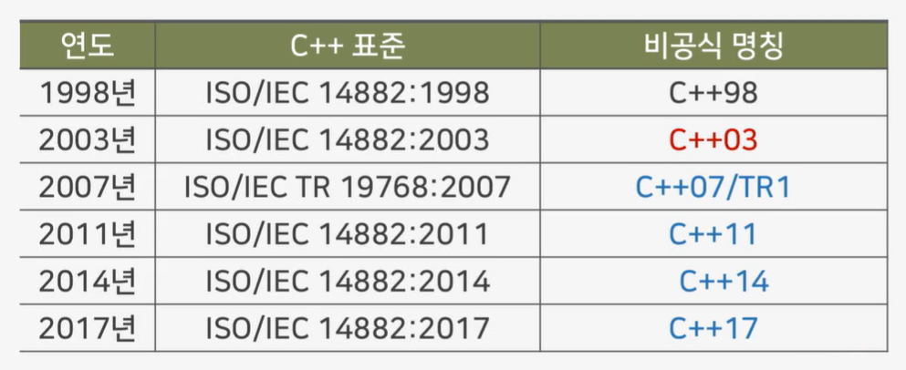
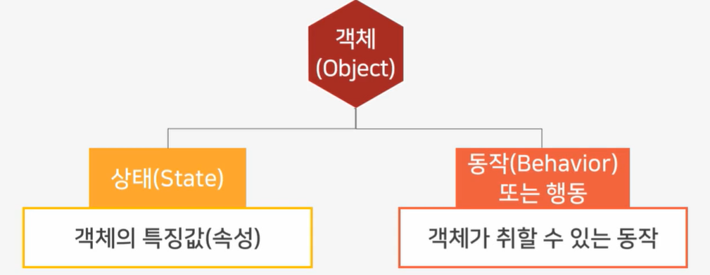

# C++ 프로그래밍이란?

# `학습개요`

### 학습 목표

- 프로그래밍의 개념을 설명할 수 있다.
- C++ 프로그래밍의 개념을 설명할 수 있다.
- 개발 환경을 구축할 수 있다.

### 학습내용

- C++ 프로그래밍 개념
- C++ 개발 환경 구축
- Visual studio C++개발

# `C++ 프로그래밍`

### 프로그래밍 언어

- 컴퓨터와 대화하는 언어 -> 각 언어마다 문법과 형식이 존재
- C++로 개발을 한다는 것 -> C++ 프로그래밍 언어를 도구로 사용해 프로그램을 작성하는 것임

- 목적 -> 사람의 생각과 언어를 컴퓨터가 이해할 수 있는 형태로 바꿔주기 위해서 만들어졌음
  - ex) C, C++, C#, JAVA 등

# `C++ 프로그래밍 언어`

### C++

- AT&A 벨 연구소의 비야네 스트롭스트롭이 1983년 발표하여 발전한 프로그래밍 언어
- 
- 객체지향언어 C++ 
  - 객체지향 : 실제 세계를 모델링하여 소프트웨어를 개발하는 방법
  - 

# `Visual Studio`

- 전세계에서 가장 많이 이용되고 있는 프로그래밍 언어 개발 프로그램
- C++ 뿐 아니라 36개의 서로 다른 언어 개발 지원
- Microsoft 의 통합 개발 환경
- Microsofr 소프트웨어 개발 플랫폼 사용
- 다운로드 가능

# `Visual studio 설치`

- visual studio code 아님..

# `실습영상`

# `C++ 생성`

# `실습영상`

