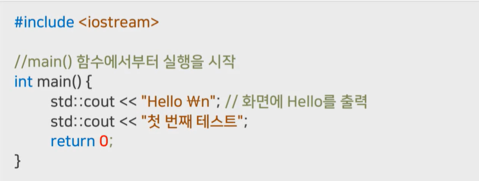
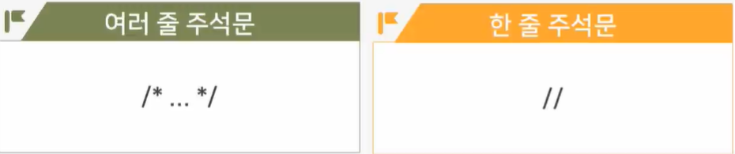
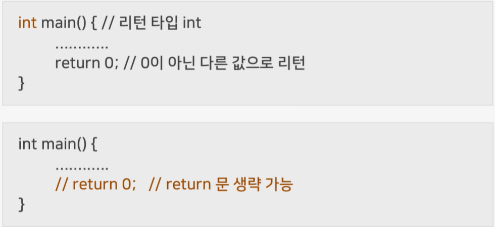
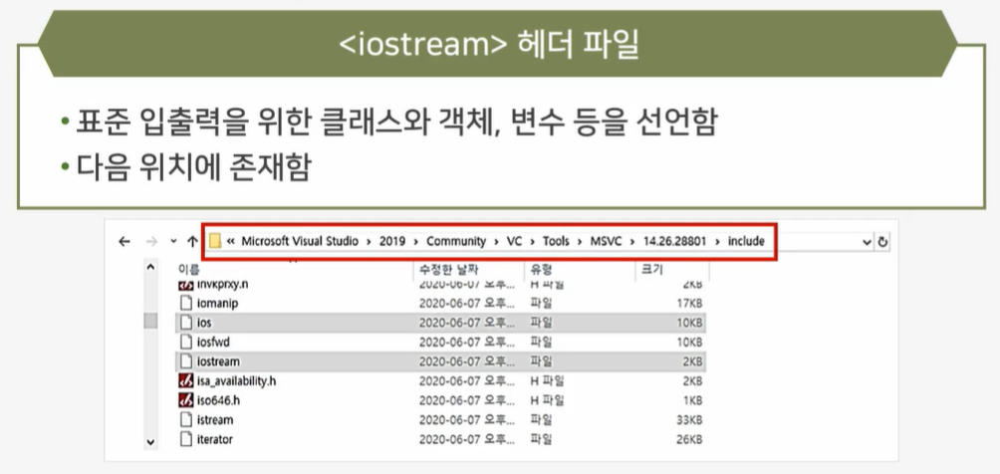
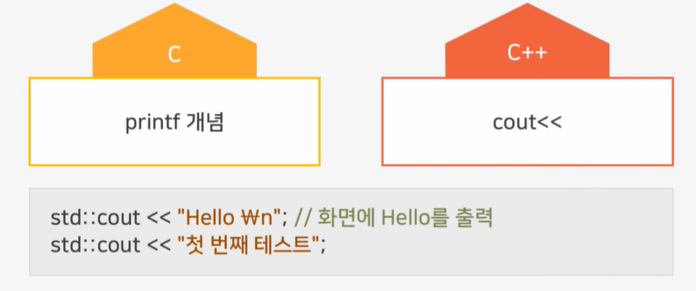
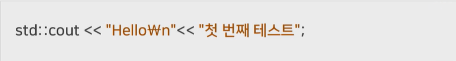
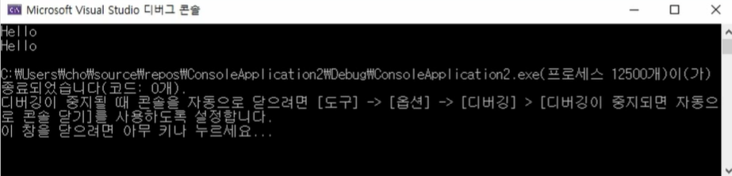
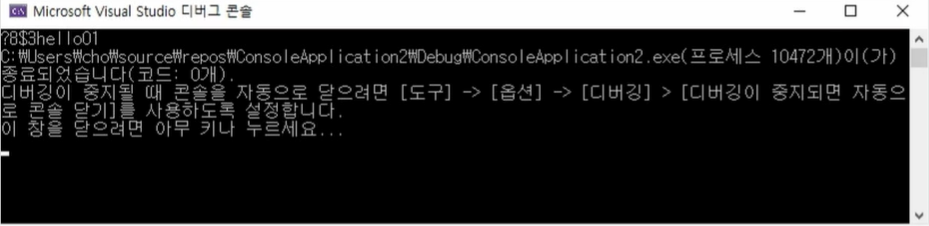
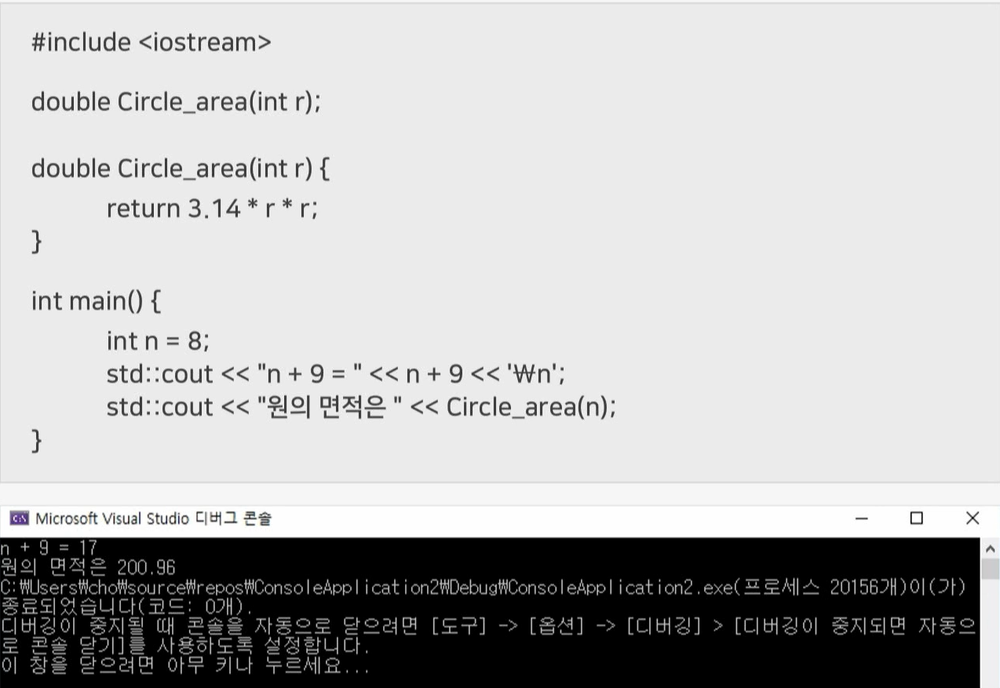
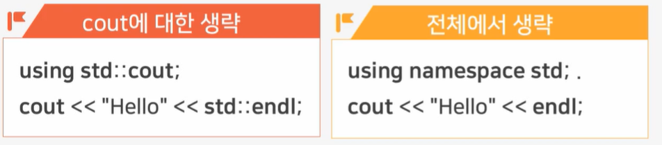

# 2강 - C++ 스타트 및 기본 개념

# `학습개요`

학습목표

- C++의 기본개념을 설명할 수 있다.
- namespace와 std::를 설명할 수 있다.
- #include <iostream>에 대해 설명할 수 있다.

학습내용

- C++ 개념잡기
- C++ 연산자
- C++ std

# `C++의 기본`

 

_ C++은 #include <iostream>으로 시작하여 main함수에서부터 실행이 시작됨

_ 중간중간 프로그램 전체에는 영향을 미치지 않으나 개발자가 표시할 수 있는 주석들을 추가할 수 있음

# `C++의 주석`

#### 개발자가 자유롭게 설명한 메모 형식의 각 스크립트에 대한 설명

실패에 영향을 미치지 않음

 

# `C++ main()함수`

#### 프로그램의 실행을 시작하는 함수

- main()함수가 종료되면 C++프로그램 종료

 

# `iostraem`

#### 전처리기(C++ Preprocessor)에게 내리는 지시

- <iostream>헤더 파일을 컴파일 전에 소스에 확장하도록 지시하는 역할을 함

 

# `C++ 연산자`

#### <iostream>헤더 파일

 

#### cout 객체

- <iostream> 헤더 파일에 선언함
- 출력 장치에 연결된 표준 C++출력 스트림 객체임
- std이름 공간에 선언 : std::cout  으로 사용

#### << 연산자

- 스트림 삽입 연산자(Stream Insertion Operator)
- 여러개의 << 연산자로 여러 값 출력이 가능함

 

# `C++ 연산자 활용`

#### 문자열, 기본 타입 데이터 출력

std::cout << "Hello" << '\n';

std::cout << "Hello" << std::endl;

- std::endl 는 밑에 한 줄 띄어서 출력하라는 얘기

 

#### bool, char, short, int, long, loat, double 타입 값 등

> int n = 3;
>
> char c = '??';
>
> std::cout << c << 8 << '$' << n << "hello" << flase << true;

 

 

# `C++ std 개념`

#### C++ 표준에서 정의한 이름 공간 중 하나임

- namespace 라고 칭함
- <iostream>헤더 파일에 선언된 모든 개념은 std namespace안에 있음
  - cout, endl 등
- std 이름 공간에 선언된 이름을 접근하기 위해 std:: 접두어를 사용함
  - std ::cout, std::endl

#### 

#### std

using을 이용하여 std:: 생략도 가능함

 

