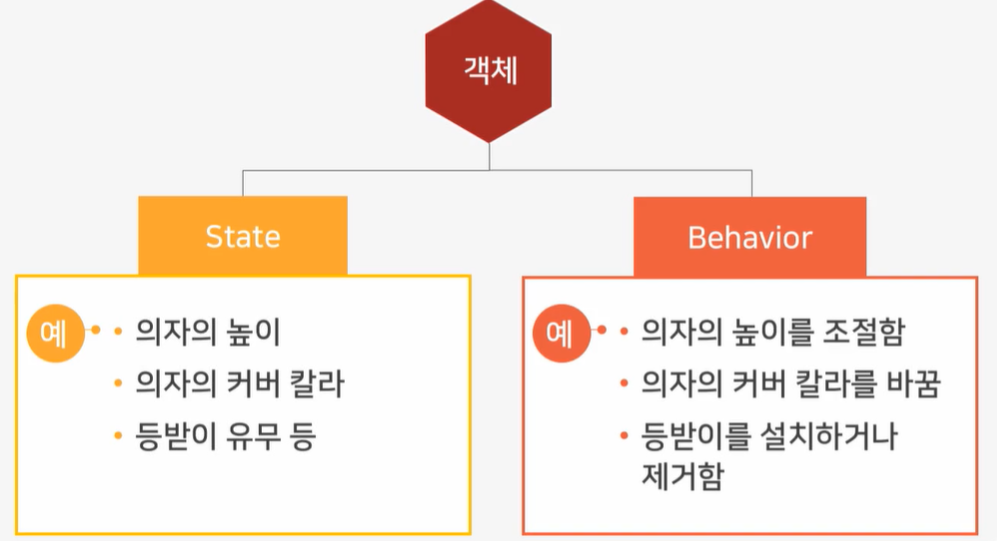
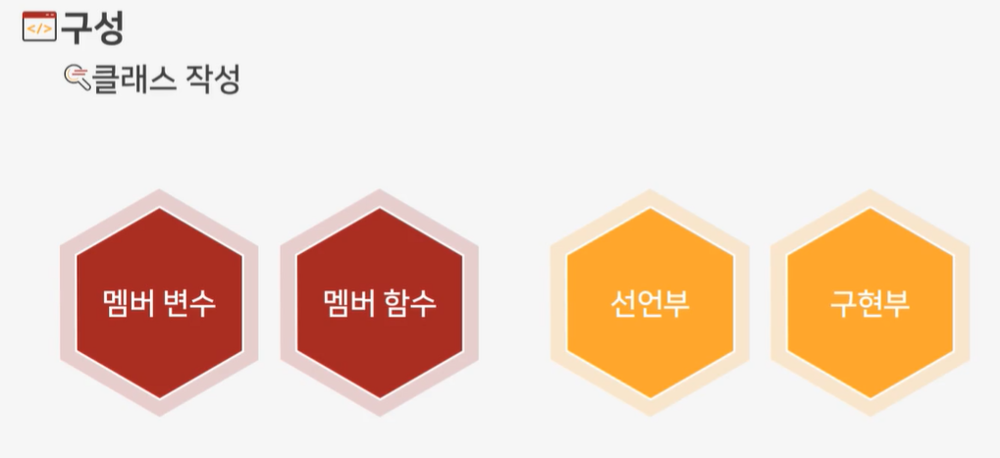
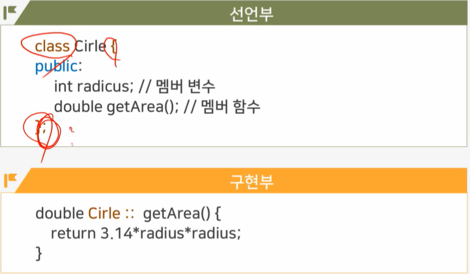
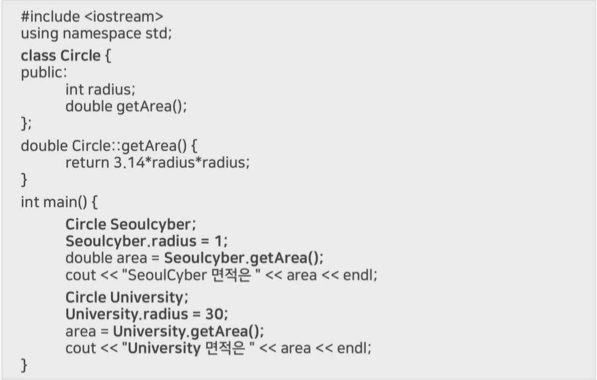
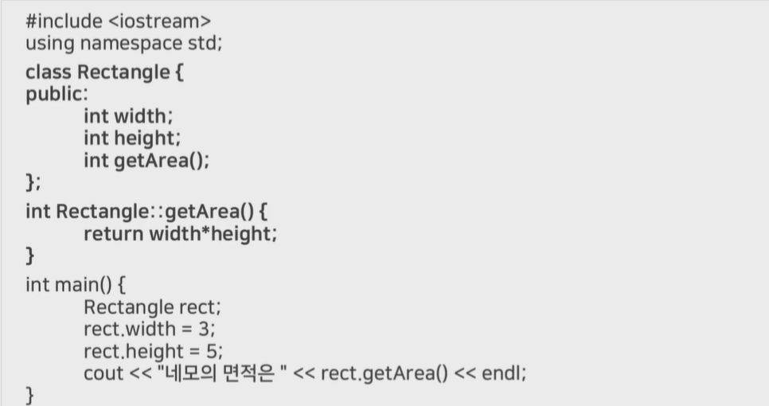
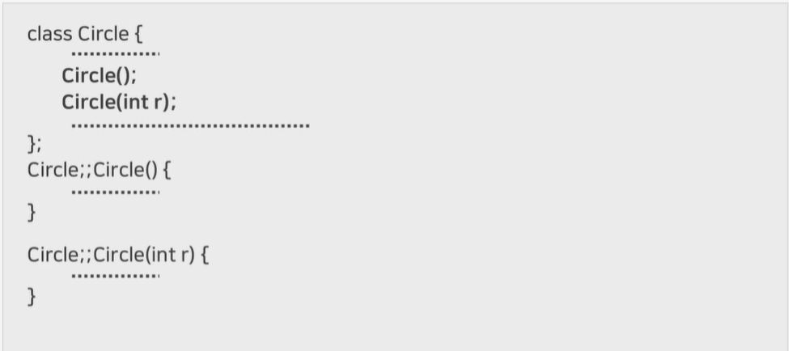
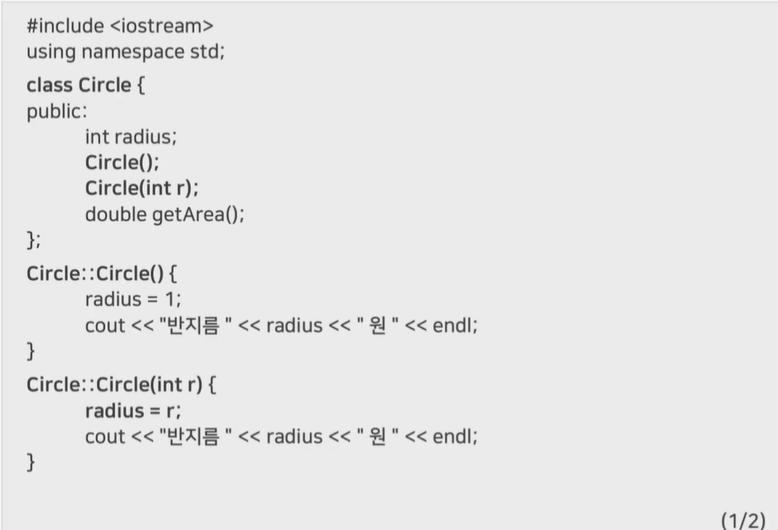
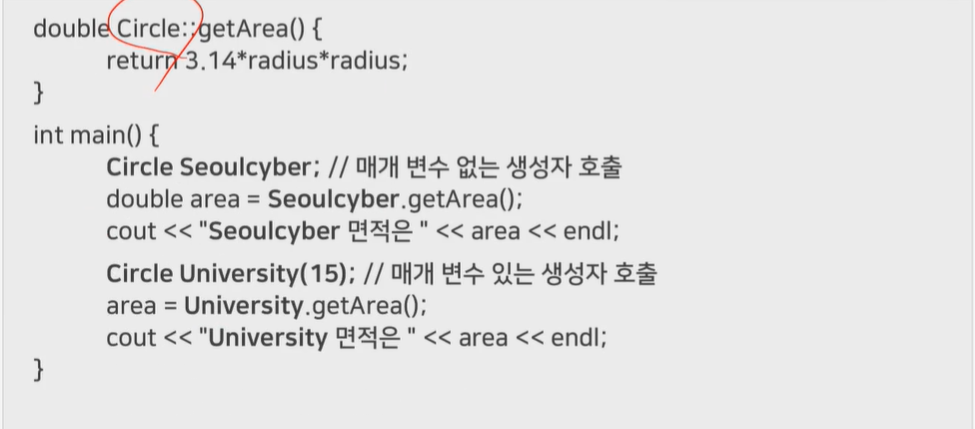
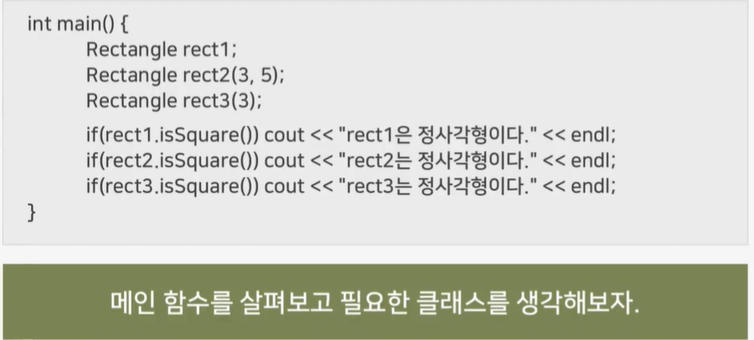

# 4강 - 객체와 클래스

# `학습개요`

학습목표

- C++ 객체에 대해 설명할 수 있다.
- C++ 클래스에 대해 설명할 수 있다.
- C++ 생성자에 대해 설명할 수 있다.

학습내용

- C++ 객체
- C++ 클래스
- C++ 생성자

# `C++객체의 개념`

#### 객체란 무엇인가?

- 세상 모든 것
  - 한 방에 있는 모든 물건들
    - 책상, 의자, 테이블, 책장, TV, 쇼파 등

#### 각 객체들은 캡슐화 되며 일부 요소는 공개됨

 

#### 클래스와 객체

클래스 : 객체를 만들기 위해 정의된 그릇, 틀

객체 : 클래스의 내용이 그대로 표현되며 하나의 클래스 안에 여러 개 생성 가능

ex ) 클래스 : 의자 , 객체 : 빨간 커버에 다리가 짧은 의자, 파란 커버에 등받이가 없는 의자 등

# `C++클래스 구성과 표현`

 

#### 구성

클래스 선언부

- 클래스 선언 : Class 키워드를 이용
- 멤버 변수와 멤버 함수 선언
- 멤버에 대한 접근 권한 지정
  - private : default
  - public : 다른 곳에서 접근이 가능함을 의미
  - Protected  :  다른 곳에서 접근 불가

클래스 구현부

- 클래스에 정의된 모든 멤버 함수 구현

 

# `클래스 실습(원의 면적)`

 

# `클래스 실습(사각형의 면적)`

 

# `생성자(constructor)`

- 객체가 생성되는 시점에서 자동으로 호출되는 멤버 함수
- 클래스 이름과 동일한 멤버 함수

 

- 생성자 네임은 클래스 네임과 동일
- 리턴 타입 선언 없음
- 객체 생성 시 자동으로 호출되며 한 번 호출함
- 생성자는 한 클래스 내에 여러 번 생성 가능하지만 하나만 생성됨

# `생성자 실습1`

 

 

# `생성자 실습 2`

 

